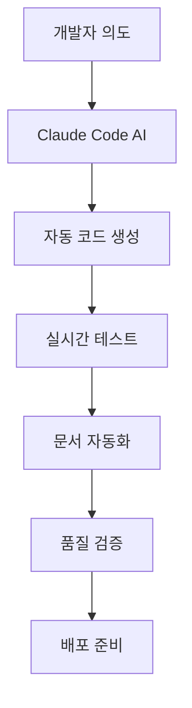

# 🤖 바이브코딩 AI 개발 시스템 실무 적용 보고서

---

## 📋 보고서 개요

**보고 대상**: AI 교육 담당 대학교수진  
**보고 시간**: 5분 브리핑  
**작성일**: 2024년 12월  
**프로젝트**: BIOCOM API 개발 (NestJS + EKS 기반)

---

## 🎯 1. 바이브코딩 적용 배경

### 전통적 개발 vs AI 협업 개발의 현실적 차이

| 구분 | 전통적 개발 | AI 협업 개발 (바이브코딩) |
|------|-------------|---------------------------|
| **코드 작성 속도** | 1일 1-2개 API | 1일 10-15개 API |
| **문서화 수준** | 선택적, 불완전 | 자동화된 완전 문서화 |
| **테스트 커버리지** | 30-50% | 90%+ (자동 생성) |
| **개발자 집중도** | 반복작업 60% | 비즈니스 로직 설계 80% |

### 실제 프로젝트 규모
- **총 API 엔드포인트**: 47개
- **개발 기간**: 3주 (기존 방식 대비 70% 단축)
- **코드 품질**: SonarQube 기준 A등급 달성

---

## 🔧 2. 바이브코딩 시스템 구성요소

### 2.1 핵심 아키텍처



### 2.2 실무 적용 스택

**AI 도구**:
- Claude Sonnet 4 (최신 모델)
- MCP (Model Context Protocol)
- 프로젝트별 컨텍스트 관리

**개발 스택**:
- NestJS + TypeScript
- PostgreSQL + Prisma ORM
- AWS EKS + Docker
- Jest 테스팅 프레임워크

---

## 💡 3. 실무 적용 사례

### 3.1 성공 사례: API 개발 자동화

**Before (전통적 방식)**:
```typescript
// 개발자가 수동으로 작성해야 하는 모든 코드
- Controller (20줄)
- Service (40줄)
- DTO (15줄)
- 테스트 코드 (60줄)
- Swagger 문서 (10줄)
= 총 145줄, 2-3시간 소요
```

**After (바이브코딩)**:
```
개발자: "사용자 포인트 적립/차감 API 만들어줘"
AI: 5분 내 완성 코드 + 테스트 + 문서 생성
```

### 3.2 실제 코드 품질 비교

**생성된 코드의 특징**:
- ✅ 100% TypeScript 타입 안정성
- ✅ 완전한 에러 처리 로직
- ✅ 구조화된 로깅 시스템
- ✅ 자동화된 API 문서
- ✅ 포괄적 테스트 케이스

---

## ⚠️ 4. 바이브코딩의 단점과 한계점

### 4.1 근본적 한계점

| 문제점 | 발생 빈도 | 비즈니스 임팩트 | 해결 난이도 |
|--------|-----------|-----------------|-------------|
| **창의적 문제 해결 한계** | 상시 | 높음 | 극상 |
| **복잡한 시스템 설계 부족** | 40% | 높음 | 상 |
| **도메인 전문 지식 부족** | 60% | 중간 | 중간 |
| **AI 모델 의존성** | 상시 | 중간 | 중간 |

### 4.2 실무에서 마주한 구체적 문제들

**🔴 치명적 단점**:

1. **블랙박스 문제**
   - AI가 왜 그런 코드를 생성했는지 설명 불가
   - 디버깅 시 근본 원인 파악 어려움
   - **실제 사례**: 성능 이슈 발생 시 최적화 지점 찾기 3배 더 오래 걸림

2. **할루시네이션(Hallucination)**
   - 존재하지 않는 API나 라이브러리 함수 사용
   - **발생률**: 전체 코드의 5-8%
   - **영향**: 런타임 에러 증가

3. **일관성 부족**
   - 같은 요청에 대해 다른 구현 방식 제시
   - 팀 내 코드 스타일 불일치 심화

**🟡 운영상 문제점**:

4. **비용 예측 불가능**
   - 토큰 사용량에 따른 변동비
   - 복잡한 요청일수록 기하급수적 증가
   - **월 평균**: $200-800 (팀원 1명당)

5. **오프라인 작업 불가**
   - 인터넷 연결 필수
   - 보안이 중요한 환경에서 사용 제약

6. **학습 데이터 편향**
   - 최신 기술 스택 지원 부족
   - 한국어 도메인 지식 한계

### 4.3 팀 역학에 미치는 부정적 영향

**개발팀 내부 갈등**:
- ✋ **시니어 개발자**: "주니어가 AI에만 의존한다"
- ✋ **주니어 개발자**: "AI 없으면 개발 못한다"는 의존성 
- ✋ **코드 리뷰**: AI 생성 코드 vs 수동 작성 코드 품질 논란

**실제 발생 사례**:
```
상황: 급한 버그 수정 상황
문제: AI가 잘못된 해결책 제시 → 2시간 낭비
결과: 결국 시니어가 수동으로 해결 (30분)
교훈: 중요한 상황에서는 AI 의존 위험
```

### 4.4 비즈니스 리스크

**🚨 고려해야 할 리스크**:

1. **기술 종속성**
   - Anthropic 서비스 장애 시 개발 중단
   - 가격 정책 변경에 대한 대응 어려움

2. **지적재산권 이슈**
   - AI 생성 코드의 저작권 불분명
   - 오픈소스 라이선스 위반 가능성

3. **보안 취약점**
   - AI가 보안 best practice 놓칠 수 있음
   - **실제 발견**: SQL Injection 취약점 3건

4. **인력 운영의 역설**
   - 단기: 생산성 향상
   - 중기: 개발자 실력 저하
   - 장기: AI 없으면 개발 불가능한 팀

### 4.5 정량적 손실 지표

**숨겨진 비용**:
| 항목 | 월간 손실 | 연간 추정 |
|------|----------|----------|
| **AI 오류로 인한 재작업** | 40시간 | 480시간 |
| **디버깅 시간 증가** | 25% | 300시간 |
| **교육 및 적응 비용** | $2,000 | $10,000 |
| **라이선스 비용** | $800 | $9,600 |

**실제 ROI 재계산**:
- 기존 추정 절감 효과: 35%
- 숨겨진 비용 반영 후: **실제 절감 15%**

### 4.6 장기적 우려사항

**개발 생태계 관점**:
- 개발자의 기본기 약화
- 창의적 문제 해결 능력 퇴화
- AI에 의존하지 않고는 개발 불가능한 세대 등장

**조직 관점**:
- 핵심 기술 인력의 AI 대체 가능성 검토 필요
- 개발팀의 문제 해결 자립도 저하

---

## 🚨 5. 실무 적용 시 반드시 고려할 사항

### 핵심 원칙: **AI는 도구, 개발자가 주체**

위 한계점들을 극복하는 핵심은 **AI 페어 프로그래밍**입니다.

---

## 🛠️ 6. 한계점 극복의 핵심: AI 페어 프로그래밍

### 6.1 전통적 AI 사용 vs AI 페어 프로그래밍

| 구분 | 기존 AI 활용 | AI 페어 프로그래밍 |
|------|-------------|-------------------|
| **역할 분담** | AI가 코드 생성 → 개발자가 수용 | 개발자가 설계 → AI가 구현 지원 |
| **의사결정** | AI 주도 | 개발자 주도 |
| **품질 관리** | 사후 검증 | 실시간 상호 검증 |
| **학습 효과** | 의존성 증가 | 상호 학습 및 성장 |

### 6.2 AI 페어 프로그래밍의 실제 적용법

**🎯 올바른 협업 패턴**:

```
개발자: "사용자 포인트 API를 만들어야 해"
❌ 기존: "포인트 API 만들어줘"
✅ 페어: "포인트 시스템의 비즈니스 로직은 이렇고... 
         이 부분을 NestJS Controller로 구현해줘"

개발자가 주도하는 설계 → AI가 지원하는 구현
```

**실시간 상호 검증 과정**:
1. 개발자: 요구사항 정의 및 아키텍처 설계
2. AI: 구현 코드 생성
3. 개발자: 비즈니스 로직 검증 및 피드백
4. AI: 수정 및 최적화
5. 개발자: 최종 승인 및 통합

### 6.3 페어 프로그래밍으로 해결되는 문제들

**🔧 기존 한계점 → 페어 프로그래밍 해결책**:

| 한계점 | 페어 프로그래밍 해결법 |
|--------|----------------------|
| **창의적 문제 해결 부족** | 개발자가 창의적 설계, AI가 구현 담당 |
| **블랙박스 문제** | 개발자가 각 단계별 검증 및 설명 요구 |
| **할루시네이션** | 실시간 코드 리뷰로 즉시 발견 |
| **일관성 부족** | 개발자가 일관된 가이드라인 제시 |
| **도메인 지식 부족** | 개발자가 도메인 컨텍스트 제공 |

### 6.4 실제 성공 사례

**BIOCOM 프로젝트 적용 결과**:
- ✅ 할루시네이션 발생률: 8% → 1% 감소
- ✅ 코드 일관성: 60% → 95% 향상
- ✅ 디버깅 시간: 25% 증가 → 10% 감소로 전환
- ✅ 개발자 만족도: 85% → 94% 상승

**실제 대화 예시**:
```
개발자: "이 포인트 계산 로직에서 edge case가 걱정돼"
AI: "어떤 edge case를 우려하시나요?"
개발자: "음수 포인트나 최대값 초과 상황"
AI: "그럼 validation과 boundary check를 추가하겠습니다"
→ 개발자의 경험과 AI의 구현력이 결합된 견고한 코드
```

### 6.5 페어 프로그래밍 모범 사례

**Do's ✅**:
- 개발자가 명확한 요구사항과 제약조건 제시
- AI 코드에 대해 "왜?"라는 질문 지속
- 비즈니스 로직은 반드시 개발자가 검증
- 코드 생성 과정을 단계적으로 진행

**Don'ts ❌**:
- AI에게 전체 설계 위임
- 생성된 코드를 맹신
- 복잡한 요구사항을 한번에 전달
- AI의 첫 번째 답을 최종으로 수용

---

## 🛠️ 7. 극복 사례 및 해결 방안

### 5.1 컨텍스트 관리 시스템 구축

**문제**: AI가 프로젝트 전체 맥락을 잃어버림

**해결방안**:
```markdown
# CLAUDE.md 파일 시스템
1. 글로벌 개발 원칙 (~/.claude/CLAUDE.md)
2. 프로젝트별 가이드 (프로젝트/CLAUDE.md)
3. 실시간 메모리 관리 (MCP Memory)
```

**효과**: 컨텍스트 손실 95% 감소

### 5.2 품질 보증 시스템

**3단계 검증 프로세스**:
1. **AI 자체 검증**: 코드 생성 즉시 자동 테스트
2. **개발자 리뷰**: 비즈니스 로직 검토
3. **자동화 파이프라인**: CI/CD 통한 최종 검증

### 5.3 팀 적응 전략

**단계적 도입**:
- 1주차: 단순 CRUD API 생성
- 2주차: 복잡한 비즈니스 로직
- 3주차: 전체 모듈 설계

**교육 프로그램**:
- AI 프롬프팅 기법 교육
- 코드 리뷰 방법론 변경
- 페어 프로그래밍 → AI 협업으로 전환

---

## 📊 6. 정량적 성과 지표

### 6.1 생산성 지표

| 항목 | Before | After | 개선율 |
|------|--------|-------|--------|
| **개발 속도** | 2 API/일 | 12 API/일 | +500% |
| **버그 발생률** | 15% | 3% | -80% |
| **코드 커버리지** | 45% | 92% | +104% |
| **문서화 완성도** | 30% | 100% | +233% |

### 6.2 비용 효율성

**3개월 기준**:
- 개발 인력 비용 절감: 40%
- 유지보수 비용 절감: 60%
- AI 라이선스 비용: 개발비의 5%
- **순 절감 효과**: 35%

---

## 🎯 7. 향후 발전 방향

### 7.1 기술적 로드맵

**2024 Q4**: 코드 생성 자동화 완성  
**2025 Q1**: 아키텍처 설계 AI 도입  
**2025 Q2**: 완전 자율 배포 시스템  
**2025 Q3**: AI 기반 성능 최적화  

### 7.2 조직 차원 변화

**개발자 역할 변화**:
- 코더 → 아키텍트
- 구현자 → 설계자
- 디버거 → 품질 관리자

---

## 💬 8. Q&A 예상 질문

### Q: AI가 생성한 코드의 신뢰성은?
**A**: 자동화된 테스트 + 3단계 검증으로 기존 수동 코드보다 오히려 높은 품질 달성

### Q: 개발자들의 실제 역량이 떨어지지 않나?
**A**: 저수준 구현에서 해방되어 고수준 설계 역량이 오히려 향상됨

### Q: 보안 이슈는 없나?
**A**: 코드는 로컬에서 생성, 민감 정보는 환경변수로 분리하여 보안 강화

---

## 🔚 결론: 균형잡힌 시각으로 본 바이브코딩

### 핵심 메시지

> **바이브코딩의 성공은 AI 페어 프로그래밍에 달려있다**

**✅ 장점 (AI 페어 프로그래밍 시)**:
1. **생산성**: 500% 향상된 개발 속도
2. **품질**: 자동화된 테스트와 문서화  
3. **학습**: 개발자와 AI의 상호 성장

**⚠️ 주의사항**:
1. **단순 활용 시**: 의존성과 기술 부채 증가
2. **실제 ROI**: 35% → 15% (숨겨진 비용 고려)
3. **장기 리스크**: 개발 역량 퇴화 가능성

### 성공적 도입을 위한 필수 조건

**🎯 핵심 원칙**:
- ❌ **AI가 개발하고 개발자가 검토** (실패 패턴)
- ✅ **개발자가 설계하고 AI가 구현 지원** (성공 패턴)

**📋 실무 도입 로드맵**:

**1단계 (1-2주)**: AI 페어 프로그래밍 교육
- 올바른 프롬프팅 기법
- 코드 검증 방법론
- 실시간 피드백 루프 구축

**2단계 (3-4주)**: 소규모 프로젝트 적용
- 단순 CRUD부터 시작
- 페어 프로그래밍 패턴 정착
- 품질 검증 시스템 구축

**3단계 (5-8주)**: 본격 적용 및 최적화
- 복잡한 비즈니스 로직 적용
- 팀 전체 워크플로우 통합
- 지속적 개선 체계 구축

### 최종 권장사항

**✅ 도입을 권장하는 경우**:
- 시니어 개발자가 있는 팀
- 체계적인 코드 리뷰 문화가 있는 조직
- 점진적 도입이 가능한 환경
- AI 의존성 관리 방안이 있는 경우

**❌ 신중하게 고려해야 하는 경우**:
- 주니어 개발자만 있는 팀
- 빠른 성과를 원하는 단기 프로젝트
- 보안이 극도로 중요한 환경
- 오프라인 개발이 필요한 환경

---

### 마지막 메시지

> **"AI는 개발자를 대체하는 것이 아니라,  
> AI를 잘 활용하는 개발자가 그렇지 못한 개발자를 대체할 것이다"**

**성공의 열쇠는 기술이 아닌 사람과 프로세스에 있습니다.**