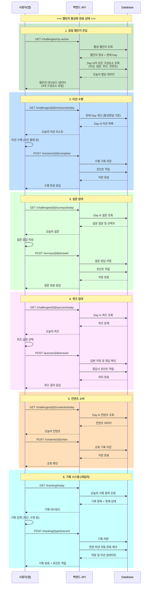
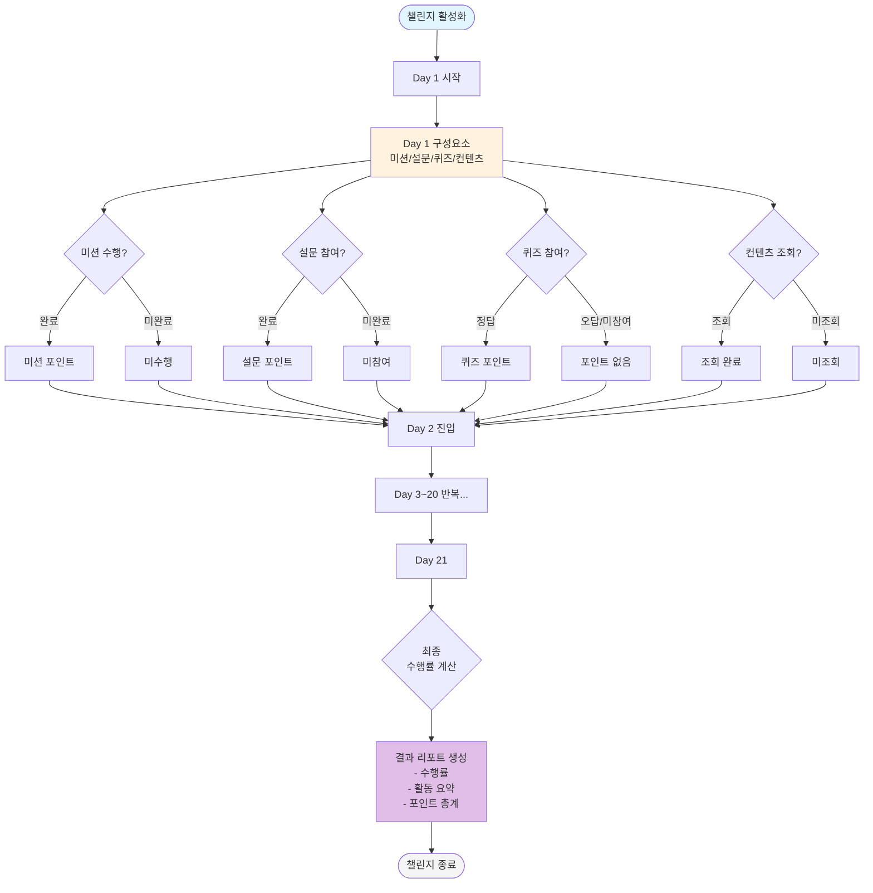
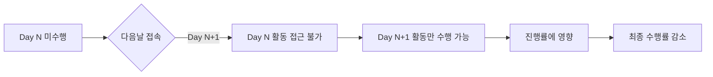

# 챌린지 활성화 이후 프로세스 플로우

> 작성일: 2025-08-28  
> 작성자: Claude Code  
> 상태: 설계 중

## 📋 전제 조건
- 사용자는 이미 챌린지 구매권을 보유
- 챌린지 활성화를 완료한 상태
- 21일 챌린지 기준으로 설계 (백오피스에서 기간 변경 가능)
- **챌린지는 4대 구성요소(미션, 설문, 퀴즈, 컨텐츠)를 포함하지만, 각 일차별로 유연하게 구성 가능**
  - 예: Day 1에는 4개 모두, Day 2에는 미션만, Day 3에는 미션+컨텐츠만 등
- **미션은 일반 미션과 기록형 미션으로 구분**
  - 일반 미션: 독립적인 수행 과제 (퀴즈, 상담 등)
  - 기록형 미션: 기록 시스템과 연동 (식단, 수면, 운동 등)

## 🔄 메인 프로세스 플로우



## 📊 일차별 진행 플로우



## 🎯 핵심 비즈니스 규칙

### 1. Day 계산 로직
```
현재 Day = (오늘 날짜 - 활성화 날짜) + 1
- Day 1: 활성화일 당일
- Day 21: 활성화일로부터 20일 후
- Day 22 이상: 챌린지 자동 종료
```

### 2. 구성요소 할당 규칙
```
- 각 Day별로 필요한 구성요소만 선택적 할당
- 백오피스에서 일차별 구성 설정
  - Day 1: 미션(3개) + 설문(1개) + 퀴즈(1개) + 컨텐츠(2개)
  - Day 2: 미션(2개)만
  - Day 3: 미션(1개) + 컨텐츠(1개)
  - Day 4: 퀴즈(1개) + 컨텐츠(1개)
  - ... (각 날짜마다 다르게 설정 가능)
- 놓친 날의 활동은 수행 불가 (엄격한 일차 관리)
```

### 3. 진행률 계산
```
진행률 = (수행 완료 활동 수 / 전체 할당 활동 수) × 100
- 실시간 계산
- 각 구성요소별 개별 진행률도 제공
```

### 4. 포인트 정책
```
- 미션 완료: 미션별 설정 포인트
- 설문 참여: 고정 포인트
- 퀴즈 정답: 정답 포인트
- 컨텐츠 조회: 조회 포인트 (선택적)
```

### 5. 컨텐츠 공개 규칙
```
- 주차별 순차 공개 (1주차 → 2주차 → 3주차)
  - 1주차: Day 1~7
  - 2주차: Day 8~14
  - 3주차: Day 15~21
- 강의: 해당 주차 도달 시 공개
- 칼럼: 해당 주차 내 모든 칼럼 열람 가능
- 최초 시청 포인트: 강의당 1회만 지급
- 컨텐츠-상품 연동: 추천 제품 구매 시 추가 포인트
```

### 6. 챌린지 종료 시 결과 리포트
```
- 전체 수행률 (%)
- 구성요소별 수행률
  - 미션: N개 중 M개 완료
  - 설문: N개 중 M개 참여
  - 퀴즈: N개 중 M개 정답
  - 컨텐츠: N개 중 M개 조회
- 총 획득 포인트
- 일별 활동 히스토리
- 가장 성실했던 기간 분석
```

## 🔀 예외 상황 처리

### 미션 미수행일 처리


## 🗄️ 상태 관리

### 챌린지 상태
```
1. PURCHASED (구매 완료)
2. ACTIVATED (활성화/진행중)
3. COMPLETED (정상 완주)
4. EXPIRED (기간 만료)
5. FAILED (실패/중도 포기)
```

### 일일 미션 상태
```
1. LOCKED (아직 도달하지 않은 날)
2. AVAILABLE (오늘 수행 가능)
3. COMPLETED (수행 완료)
4. MISSED (놓친 미션)
```

## 📱 주요 API 엔드포인트 (예정)

```typescript
// === 챌린지 메인 ===
// 내 활성 챌린지 조회
GET /api/challenges/my-active

// 진행 현황 조회 (4대 구성요소 통합)
GET /api/challenges/{challengeId}/progress

// 전체 일정 조회 (21일 전체 스케줄)
GET /api/challenges/{challengeId}/schedule

// 챌린지 종료 후 결과 리포트 조회
GET /api/challenges/{challengeId}/report

// === 미션 ===
// 오늘의 미션 조회
GET /api/challenges/{challengeId}/missions/today

// 미션 완료 처리
POST /api/missions/{missionId}/complete

// === 설문 ===
// 오늘의 설문 조회
GET /api/challenges/{challengeId}/surveys/today

// 설문 응답 제출
POST /api/surveys/{surveyId}/answer

// === 퀴즈 ===
// 오늘의 퀴즈 조회
GET /api/challenges/{challengeId}/quizzes/today

// 퀴즈 답변 제출
POST /api/quizzes/{quizId}/answer

// === 컨텐츠 ===
// 오늘의 컨텐츠 조회
GET /api/challenges/{challengeId}/contents/today

// 컨텐츠 조회 기록
POST /api/contents/{contentId}/view

// === 기록 시스템 ===
// 오늘의 기록 항목 조회
GET /api/tracking/today

// 기록 입력/수정
POST /api/tracking/{type}/record

// 기록 히스토리 조회
GET /api/tracking/history

// 특정 날짜 기록 조회
GET /api/tracking/{date}
```

## 💾 필요한 데이터 구조

### challenges (챌린지 마스터)
```sql
- id
- name (챌린지명)
- description
- totalDays (전체 기간: 7, 14, 21, 30 등)
- price (수행권 가격)
- isActive
```

### missions (미션 마스터 - 개선)
```sql
- id
- code
- name
- type (NORMAL/TRACKING)
- trackingCode (TRACKING 타입일 때: DIET, SLEEP, EXERCISE 등)
- points (획득 포인트)
- requireUpload (사진 업로드 필요 여부)
```

### tracking_items (기록 항목 마스터)
```sql
- id
- code (DIET, SLEEP, EXERCISE, WATER, MEDICATION 등)
- name (식단기록, 수면기록, 운동기록 등)
- unit (칼로리, 시간, 횟수, ml 등)
- defaultTarget (기본 목표값)
- inputType (NUMBER, TIME, PHOTO, SELECT 등)
```

### challenge_day_configs (일차별 구성 설정)
```sql
- id
- challengeId
- day (1~N)
- hasMission (미션 포함 여부)
- missionCount (미션 개수)
- hasSurvey (설문 포함 여부)
- surveyCount (설문 개수)
- hasQuiz (퀴즈 포함 여부)
- quizCount (퀴즈 개수)
- hasContent (컨텐츠 포함 여부)
- contentCount (컨텐츠 개수)
```

### user_challenges (개인별 챌린지 진행)
```sql
- id
- userId
- challengeId  
- ticketId (구매권 ID)
- activatedAt (활성화 시점)
- expiresAt (activatedAt + totalDays)
- currentDay (현재 진행 일차)
- completedDays (완료한 일수)
- totalPoints (획득 포인트)
- status
```

### daily_progress (일별 진행 기록)
```sql
- id
- userChallengeId
- day (1~N)
- date (실제 날짜)
- missionsCompleted (완료 미션 수)
- totalMissions (해당일 전체 미션 수)
- surveysCompleted (완료 설문 수)
- totalSurveys (해당일 전체 설문 수)
- quizzesCorrect (정답 퀴즈 수)
- totalQuizzes (해당일 전체 퀴즈 수)
- contentsViewed (조회 컨텐츠 수)
- totalContents (해당일 전체 컨텐츠 수)
- pointsEarned (획득 포인트)
- completedAt
```

### tracking_records (기록 데이터)
```sql
- id
- userId
- userChallengeId
- trackingCode (DIET, SLEEP 등)
- date (기록 날짜)
- value (기록값)
- unit (단위)
- metadata (JSON: 추가 정보)
- createdAt
- updatedAt
```

### contents (컨텐츠 마스터 - 강화)
```sql
- id
- title
- description
- type (LECTURE/COLUMN)
- weekNumber (해당 주차: 1, 2, 3 등)
- dayUnlockFrom (공개 시작일: Day 1, Day 8, Day 15)
- chapterNumber (강의 챕터 번호)
- videoUrl (강의 영상 URL)
- thumbnailUrl (썸네일 이미지)
- duration (강의 시간: "00:45")
- viewPoints (시청 완료 포인트)
- firstViewOnly (최초 시청만 포인트 지급 여부)
```

### content_products (컨텐츠-상품 연결)
```sql
- id
- contentId
- productId
- displayOrder
- recommendationText (추천 문구)
- additionalPoints (추가 구매 포인트)
```

### content_views (컨텐츠 조회 기록)
```sql
- id
- userId
- contentId
- userChallengeId
- viewedAt
- completedAt (시청 완료 시점)
- pointsEarned (획득 포인트)
```

## 📌 일차별 구성 예시

### 21일 챌린지 구성 예시
```
Day 1: [온보딩] 
  - 일반 미션: 프로필 설정 (100P)
  - 기록형 미션: 식단 기록 3회 (300P)
  - 설문: 건강 상태 체크
  
Day 2: [기본 루틴]
  - 기록형 미션: 수면 시간 기록 (200P)
  - 일반 미션: 퀴즈 풀기 (100P)
  
Day 3: [식단 집중]
  - 기록형 미션: 식단 기록 3회 (300P)
  - 기록형 미션: 물 섭취량 기록 (100P)
  - 일반 미션: 강의 "나에게 안 맞는 음식" 시청 (200P)
  - 컨텐츠: 칼럼 "올바른 식습관 가이드" 읽기
  
Day 7: [1주차 마무리]
  - 일반 미션: 1:1 상담 신청 (500P)
  - 설문: 1주차 만족도 조사
  
Day 8: [2주차 시작]
  - 컨텐츠: 2주차 강의/칼럼 공개
  - 일반 미션: 2주차 첫 강의 시청 (200P)
  
Day 14: [2주차 마무리]
  - 모든 기록 항목 완료 시 보너스 (1000P)
  
Day 15: [3주차 시작]
  - 컨텐츠: 3주차 강의/칼럼 공개
  - 일반 미션: "피부 해독" 강의 시청 (200P)
  
Day 21: [최종일]
  - 설문: 챌린지 종합 평가
  - 일반 미션: 후기 작성 (500P)
```

### 미션-기록 연동 예시
```
사용자 시나리오:
1. 미션 탭에서 "식단 기록하고 300P" 클릭
2. 기록 화면으로 이동
3. 아침/점심/저녁 식단 입력
4. 3회 모두 입력 완료 시:
   - 미션 자동 완료 처리
   - 300P 자동 지급
   - 기록 탭에도 완료 표시
```

### API 응답 예시 (GET /challenges/{id}/schedule)
```json
{
  "challengeId": "ch_123",
  "totalDays": 21,
  "schedule": [
    {
      "day": 1,
      "date": "2024-01-01",
      "components": {
        "missions": 2,
        "surveys": 1,
        "quizzes": 0,
        "contents": 1
      },
      "theme": "온보딩"
    },
    {
      "day": 2,
      "date": "2024-01-02",
      "components": {
        "missions": 3,
        "surveys": 0,
        "quizzes": 0,
        "contents": 0
      },
      "theme": "기본"
    }
    // ... 21일치 데이터
  ]
}
```

## 📝 추후 구현 예정 기능

### 1:1 맞춤 컨설팅 시스템 (우선순위: 낮음)
> 12월 오픈 이후 단계적 구현 예정

#### 사용자 앱 기능
```
- 상담 예약 (날짜/시간 선택)
- 상담사 선택
- 상담 내역 확인
- 상담 답변 및 추천 제품 확인
- 상담 후기 작성 (별점 + 텍스트)
```

#### 백오피스 필요 기능
```
- 상담사 계정 관리
- 상담 예약 관리 (달력 뷰)
- 상담 답변 작성 인터페이스
- 제품 추천 연결
- 상담 통계/리포트
- 예약 알림 시스템
```

#### 필요 테이블 (개념)
```sql
consultations (상담 예약)
consultation_slots (상담 가능 시간)  
consultation_responses (상담 답변)
consultation_products (추천 제품)
consultation_reviews (상담 후기)
```

#### 미션 연동
```
- "1:1 상담 신청하고 500P 받기" (월 1회)
- 상담 후기 작성 미션 (추가 포인트)
```

**참고**: 챌린지가 핵심 서비스이므로, MVP는 챌린지 기능 완성 후 구현

## 🎯 다음 단계

1. 이 플로우에 대한 형님의 피드백 반영
2. DB 스키마 상세 설계
3. API 명세서 작성
4. 기존 시스템과의 통합 방안 수립

---

*이 문서는 챌린지 활성화 이후의 전체 프로세스를 정의합니다.*