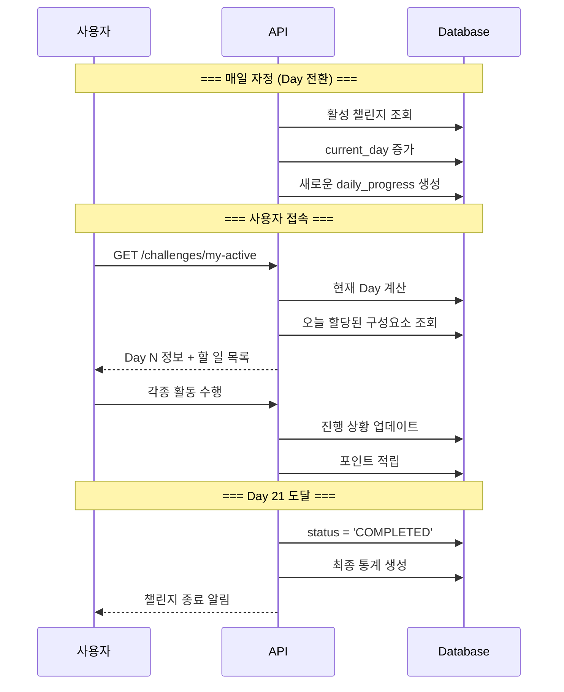

# 챌린지 시스템 구현 계획

> 작성일: 2025-08-28  
> 작성자: Claude Code  
> 목적: 챌린지 활성화 이후 프로세스 구현

## 📌 구현 전제 조건
- 챌린지 구매는 이미 완료된 상태
- 사용자는 챌린지 수행권을 보유
- **시작점: `/challenges/activate` API 호출**

## 🗄️ 테이블 설계

### 1. challenges (챌린지 마스터)
```sql
CREATE TABLE challenges (
  id SERIAL PRIMARY KEY,
  name VARCHAR(255) NOT NULL,
  description TEXT,
  total_days INTEGER DEFAULT 21,  -- 챌린지 기간 (7, 14, 21, 30일 등)
  price DECIMAL(10, 2),
  is_active BOOLEAN DEFAULT true,
  created_at TIMESTAMP DEFAULT CURRENT_TIMESTAMP,
  updated_at TIMESTAMP DEFAULT CURRENT_TIMESTAMP
);
```

### 2. challenge_tickets (챌린지 수행권)
```sql
CREATE TABLE challenge_tickets (
  id SERIAL PRIMARY KEY,
  user_id INTEGER NOT NULL REFERENCES users(id),
  challenge_id INTEGER NOT NULL REFERENCES challenges(id),
  purchase_date TIMESTAMP NOT NULL,
  purchase_price DECIMAL(10, 2),
  status VARCHAR(20) DEFAULT 'PURCHASED',  -- PURCHASED, ACTIVATED, COMPLETED, EXPIRED
  created_at TIMESTAMP DEFAULT CURRENT_TIMESTAMP,
  updated_at TIMESTAMP DEFAULT CURRENT_TIMESTAMP,
  
  INDEX idx_user_status (user_id, status)
);
```

### 3. user_challenges (사용자별 활성 챌린지)
```sql
CREATE TABLE user_challenges (
  id SERIAL PRIMARY KEY,
  user_id INTEGER NOT NULL REFERENCES users(id),
  challenge_id INTEGER NOT NULL REFERENCES challenges(id),
  ticket_id INTEGER NOT NULL REFERENCES challenge_tickets(id),
  activated_at TIMESTAMP NOT NULL,  -- 활성화 시점
  expires_at TIMESTAMP NOT NULL,    -- 종료 예정일 (activated_at + total_days)
  current_day INTEGER DEFAULT 1,    -- 현재 진행 일차
  status VARCHAR(20) DEFAULT 'ACTIVE',  -- ACTIVE, COMPLETED, EXPIRED
  created_at TIMESTAMP DEFAULT CURRENT_TIMESTAMP,
  updated_at TIMESTAMP DEFAULT CURRENT_TIMESTAMP,
  
  INDEX idx_user_active (user_id, status),
  UNIQUE KEY unique_active_challenge (user_id, status)  -- 한 번에 하나만 활성화
);
```

### 4. daily_progress (일별 진행 상황)
```sql
CREATE TABLE daily_progress (
  id SERIAL PRIMARY KEY,
  user_challenge_id INTEGER NOT NULL REFERENCES user_challenges(id),
  day INTEGER NOT NULL,  -- 1~N
  date DATE NOT NULL,     -- 실제 날짜
  
  -- 미션 진행
  missions_total INTEGER DEFAULT 0,
  missions_completed INTEGER DEFAULT 0,
  
  -- 설문 진행
  surveys_total INTEGER DEFAULT 0,
  surveys_completed INTEGER DEFAULT 0,
  
  -- 퀴즈 진행
  quizzes_total INTEGER DEFAULT 0,
  quizzes_correct INTEGER DEFAULT 0,
  
  -- 컨텐츠 진행
  contents_total INTEGER DEFAULT 0,
  contents_viewed INTEGER DEFAULT 0,
  
  -- 기록 진행
  trackings_total INTEGER DEFAULT 0,
  trackings_completed INTEGER DEFAULT 0,
  
  points_earned INTEGER DEFAULT 0,
  created_at TIMESTAMP DEFAULT CURRENT_TIMESTAMP,
  updated_at TIMESTAMP DEFAULT CURRENT_TIMESTAMP,
  
  UNIQUE KEY unique_day_progress (user_challenge_id, day)
);
```

## 🔥 핵심 API: `/challenges/activate`

### POST /challenges/activate
챌린지 수행권을 활성화하여 챌린지를 시작합니다.

#### Request
```typescript
{
  ticketId: number;  // 활성화할 수행권 ID
}
```

#### Process
```sql
-- 1. 이미 활성 챌린지가 있는지 확인
SELECT * FROM user_challenges 
WHERE user_id = ? AND status = 'ACTIVE';

-- 2. 수행권 상태 확인
SELECT * FROM challenge_tickets 
WHERE id = ? AND user_id = ? AND status = 'PURCHASED';

-- 3. 챌린지 정보 조회
SELECT * FROM challenges WHERE id = ?;

-- 4. user_challenges 생성
INSERT INTO user_challenges (
  user_id, challenge_id, ticket_id,
  activated_at, expires_at, status
) VALUES (
  ?, ?, ?,
  NOW(), DATE_ADD(NOW(), INTERVAL ? DAY), 'ACTIVE'
);

-- 5. challenge_tickets 상태 업데이트
UPDATE challenge_tickets 
SET status = 'ACTIVATED', updated_at = NOW()
WHERE id = ?;

-- 6. 첫날(Day 1) daily_progress 생성
INSERT INTO daily_progress (
  user_challenge_id, day, date,
  missions_total, surveys_total, quizzes_total, contents_total
) VALUES (
  ?, 1, CURDATE(),
  ?, ?, ?, ?  -- Day 1에 할당된 구성요소 개수
);
```

#### Response
```typescript
{
  success: true,
  data: {
    userChallengeId: number;
    challengeName: string;
    activatedAt: Date;
    expiresAt: Date;
    totalDays: number;
    currentDay: 1;
    todayComponents: {
      missions: number;
      surveys: number;
      quizzes: number;
      contents: number;
    }
  }
}
```

#### Error Cases
- 409: 이미 활성 챌린지가 있음
- 404: 수행권을 찾을 수 없음
- 400: 이미 사용된 수행권

## 📋 활성화 이후 주요 API 목록

### 1. 챌린지 조회
- `GET /challenges/my-active` - 내 활성 챌린지 조회
- `GET /challenges/{id}/progress` - 진행 상황 조회
- `GET /challenges/{id}/schedule` - 전체 일정 조회

### 2. 일일 활동
- `GET /challenges/{id}/today` - 오늘의 모든 활동
- `GET /challenges/{id}/missions/today` - 오늘의 미션
- `GET /challenges/{id}/surveys/today` - 오늘의 설문
- `GET /challenges/{id}/quizzes/today` - 오늘의 퀴즈
- `GET /challenges/{id}/contents/today` - 오늘의 컨텐츠

### 3. 활동 수행
- `POST /missions/{id}/complete` - 미션 완료
- `POST /surveys/{id}/answer` - 설문 응답
- `POST /quizzes/{id}/answer` - 퀴즈 답변
- `POST /contents/{id}/view` - 컨텐츠 시청
- `POST /tracking/{type}/record` - 기록 입력

### 4. 종료 처리
- `GET /challenges/{id}/report` - 결과 리포트

## 🔄 Day 진행 플로우



## 🎯 다음 단계

1. ✅ 챌린지 활성화 API 및 테이블 설계
2. ⏳ 일일 활동 API 구현
3. ⏳ 미션-기록 연동 로직
4. ⏳ 진행률 계산 및 리포트

---

*활성화 이후 모든 프로세스는 이 문서를 기준으로 구현*