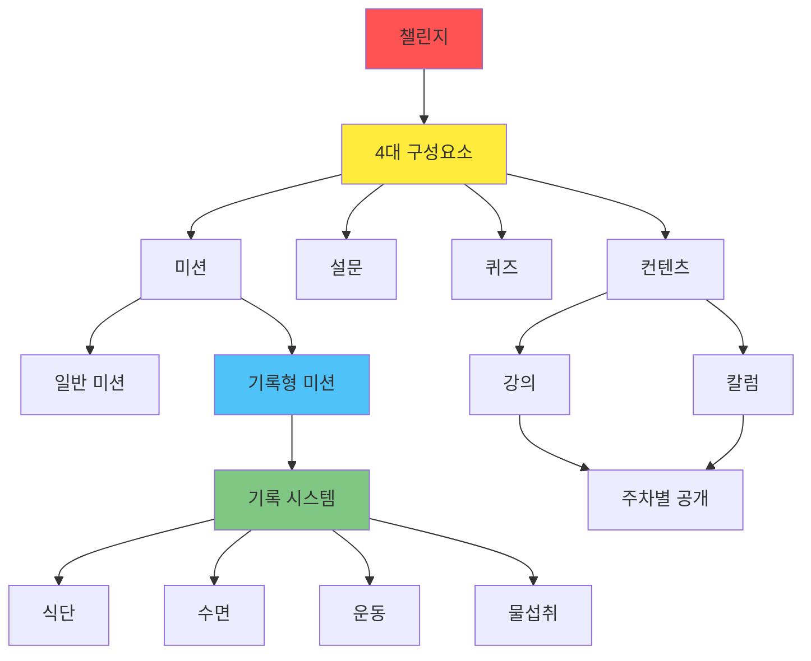
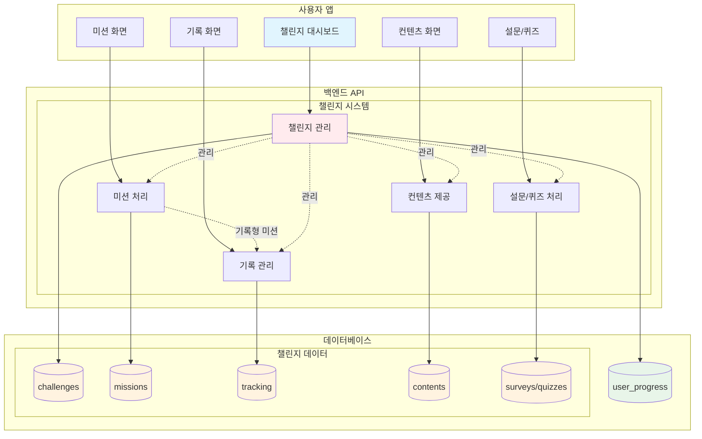
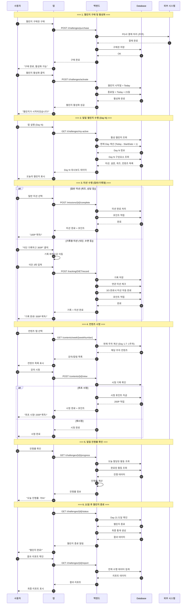
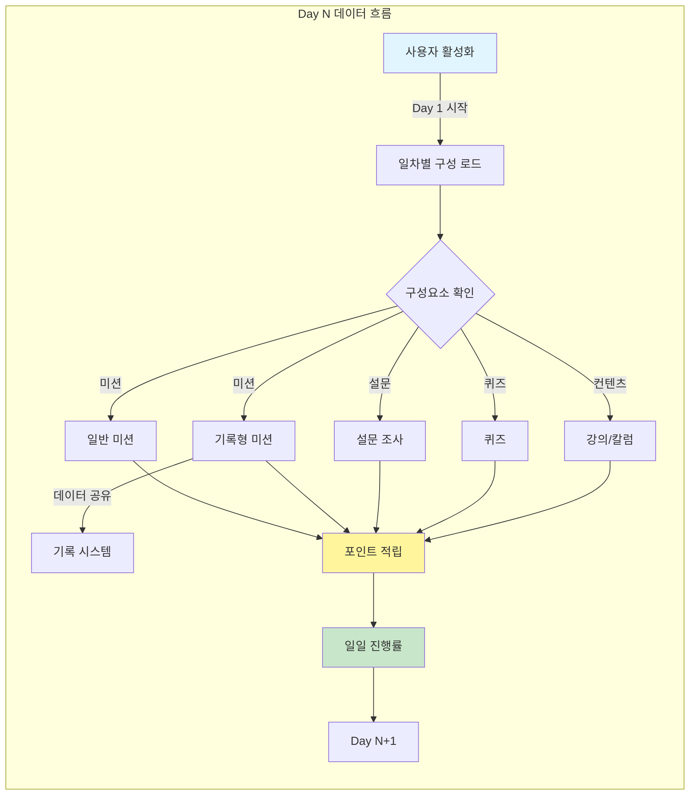
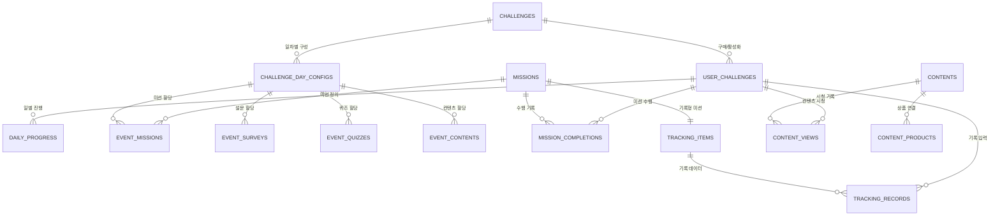
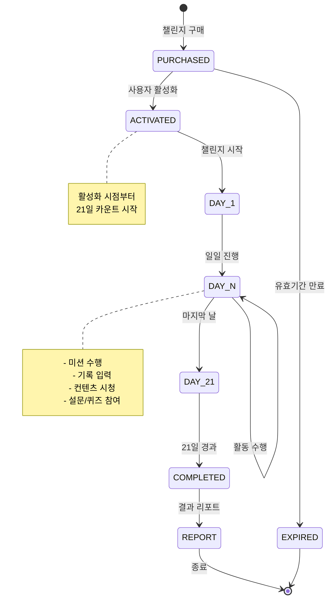
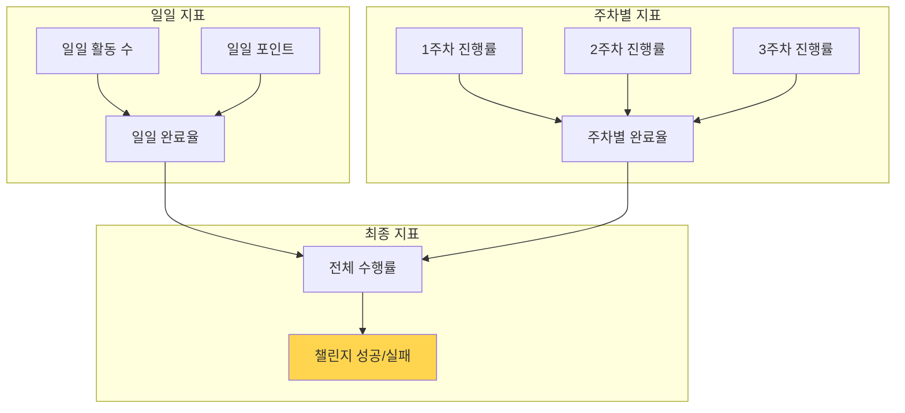

# 챌린지 시스템 MVP 최종 설계

> 작성일: 2025-08-28  
> 작성자: Claude Code  
> 상태: MVP 최종 확정

## 🎯 MVP 범위
- **포함**: 챌린지 핵심 기능 (미션, 설문, 퀴즈, 컨텐츠, 기록)
- **제외**: 1:1 상담 시스템 (추후 구현)

## 🏗️ 챌린지 계층 구조

## 📊 전체 시스템 구조

## 🔄 챌린지 라이프사이클

## 🗂️ 데이터 플로우

## 💾 핵심 데이터 모델

## 📈 상태 전이 다이어그램

## 🎯 MVP 핵심 지표

## ✅ MVP 체크리스트

### 필수 구현
- [x] 챌린지 구매권 시스템
- [x] 개인별 챌린지 활성화
- [x] Day 기반 진행 관리
- [x] 4대 구성요소 (미션, 설문, 퀴즈, 컨텐츠)
- [x] 기록 시스템 (미션과 연동)
- [x] 포인트 시스템
- [x] 주차별 컨텐츠 공개
- [x] 결과 리포트

### 추후 구현
- [ ] 1:1 상담 시스템
- [ ] 푸시 알림
- [ ] 보상 시스템
- [ ] 소셜 기능

---

*이 문서는 12월 오픈을 위한 MVP 최종 설계입니다.*