# 바이오컴 전체 통합 ERD v1.0

> 작성일: 2025-08-12  
> 작성자: Claude Code (대길 형님 지도하에)  
> 버전: 1.0.0

## 1. 전체 시스템 ERD

```mermaid
erDiagram
    %% ==========================================
    %% 사용자 도메인
    %% ==========================================
    User {
        int id "사용자ID"
        string email "이메일"
        string password "비밀번호"
        string name "이름(암호화)"
        string mobile "휴대폰(암호화)"
        int points "포인트잔액"
        boolean is_active "활성여부"
        datetime last_login_at "최종로그인"
        datetime created_at "생성일시"
        datetime updated_at "수정일시"
    }
    
    LoginHistory {
        int id "로그인ID"
        int user_id "사용자ID"
        string ip_address "IP주소"
        string user_agent "브라우저정보"
        string device_type "기기타입"
        boolean is_success "성공여부"
        datetime created_at "로그인시간"
    }
    
    %% ==========================================
    %% 이벤트/챌린지 도메인
    %% ==========================================
    Event {
        int id "이벤트ID"
        string name "이벤트명"
        string type "타입(챌린지/프로모션)"
        date start_date "시작일"
        date end_date "종료일"
        int total_days "총일수"
        boolean is_active "활성여부"
        string description "설명"
        datetime created_at "생성일시"
        datetime updated_at "수정일시"
    }
    
    EventUser {
        int id "참여ID"
        int event_id "이벤트ID"
        int user_id "사용자ID"
        datetime joined_at "참여일시"
        string status "상태"
        datetime completed_at "완료일시"
        int total_points "총획득포인트"
        int completed_days "완료일수"
        datetime created_at "생성일시"
        datetime updated_at "수정일시"
    }
    
    Mission {
        int id "미션ID"
        string code "미션코드"
        string name "미션명"
        string description "설명"
        int points "포인트"
        boolean require_upload "업로드필수여부"
        string type "타입(일일/주간/특별)"
        string upload_type "업로드타입"
        int daily_limit "일일제한"
        boolean is_active "활성여부"
        datetime created_at "생성일시"
        datetime updated_at "수정일시"
    }
    
    EventMission {
        int id "이벤트미션ID"
        int event_id "이벤트ID"
        int mission_id "미션ID"
        int points "포인트"
        int active_from_day "시작일차"
        int active_to_day "종료일차"
        boolean is_active "활성여부"
        int sort_order "정렬순서"
        datetime created_at "생성일시"
        datetime updated_at "수정일시"
    }
    
    MissionCompletion {
        int id "완료ID"
        int event_user_id "참여ID"
        int event_mission_id "이벤트미션ID"
        int day "일차"
        datetime completed_at "완료일시"
        int points_earned "획득포인트"
        int file_upload_id "파일ID"
        datetime created_at "생성일시"
        datetime updated_at "수정일시"
    }
    
    MissionSchedule {
        int id "스케줄ID"
        int mission_id "미션ID"
        int day "일차"
        string title "제목"
        string description "설명"
        json data "추가데이터"
        string type "타입"
        datetime created_at "생성일시"
        datetime updated_at "수정일시"
    }
    
    %% ==========================================
    %% 설문 도메인
    %% ==========================================
    Survey {
        int id "설문ID"
        string name "설문명"
        string description "설명"
        boolean is_active "활성여부"
        datetime created_at "생성일시"
        datetime updated_at "수정일시"
    }
    
    EventSurvey {
        int id "이벤트설문ID"
        int event_id "이벤트ID"
        int survey_id "설문ID"
        json survey_options "설문옵션"
        boolean is_active "활성여부"
        datetime created_at "생성일시"
        datetime updated_at "수정일시"
    }
    
    SurveyQuestion {
        int id "질문ID"
        int survey_id "설문ID"
        string category "카테고리"
        string question_text "질문내용"
        int sort_order "정렬순서"
        datetime created_at "생성일시"
        datetime updated_at "수정일시"
    }
    
    SurveyOption {
        int id "옵션ID"
        string option_text "옵션내용"
        int score "점수"
        datetime created_at "생성일시"
    }
    
    SurveyAnswer {
        int id "답변ID"
        int user_id "사용자ID"
        int event_user_id "참여ID"
        int survey_question_id "질문ID"
        int survey_option_id "옵션ID"
        string type "타입"
        datetime created_at "생성일시"
        datetime updated_at "수정일시"
    }
    
    %% ==========================================
    %% 퀴즈 도메인
    %% ==========================================
    Quiz {
        int id "퀴즈ID"
        string title "제목"
        string question "문제"
        json options "선택지"
        int correct_answer "정답"
        int points "포인트"
        string category "카테고리"
        boolean is_active "활성여부"
        datetime created_at "생성일시"
        datetime updated_at "수정일시"
    }
    
    EventQuiz {
        int id "이벤트퀴즈ID"
        int event_id "이벤트ID"
        int quiz_id "퀴즈ID"
        int day "일차"
        boolean is_active "활성여부"
        datetime created_at "생성일시"
        datetime updated_at "수정일시"
    }
    
    QuizAnswer {
        int id "답변ID"
        int event_user_id "참여ID"
        int event_quiz_id "이벤트퀴즈ID"
        int selected_answer "선택답변"
        boolean is_correct "정답여부"
        int points_earned "획듍포인트"
        datetime answered_at "답변일시"
        datetime created_at "생성일시"
        datetime updated_at "수정일시"
    }
    
    %% ==========================================
    %% 컨텐츠 도메인
    %% ==========================================
    Content {
        int id "컨텐츠ID"
        string title "제목"
        text content "내용"
        string type "타입"
        boolean is_active "활성여부"
        datetime created_at "생성일시"
        datetime updated_at "수정일시"
    }
    
    EventContent {
        int id "이벤트컨텐츠ID"
        int event_id "이벤트ID"
        int content_id "컨텐츠ID"
        int day "일차"
        boolean is_active "활성여부"
        datetime created_at "생성일시"
        datetime updated_at "수정일시"
    }
    
    ContentFile {
        int id "관계ID"
        int content_id "컨텐츠ID"
        int file_upload_id "파일ID"
        int sort_order "정렬순서"
        datetime created_at "생성일시"
        datetime updated_at "수정일시"
    }
    
    ProductFile {
        int id "관계ID"
        int product_id "상품ID"
        int file_upload_id "파일ID"
        int sort_order "정렬순서"
        boolean is_main "대표이미지여부"
        datetime created_at "생성일시"
        datetime updated_at "수정일시"
    }
    
    %% ==========================================
    %% 포인트 도메인
    %% ==========================================
    PointHistory {
        int id "포인트ID"
        int user_id "사용자ID"
        string type "타입(적립/사용/만료)"
        int amount "금액"
        int balance "잔액"
        string description "설명"
        string related_type "관련타입"
        int related_id "관련ID"
        datetime created_at "생성일시"
    }
    
    %% ==========================================
    %% 파일 업로드 도메인
    %% ==========================================
    FileUpload {
        int id "파일ID"
        int user_id "사용자ID"
        string original_name "원본파일명"
        string filename "저장파일명"
        string mimetype "MIME타입"
        int size "크기"
        string path "경로"
        string file_url "S3_URL"
        string file_type "파일타입"
        string upload_category "업로드카테고리"
        datetime uploaded_at "업로드일시"
        datetime created_at "생성일시"
        datetime updated_at "수정일시"
    }
    
    %% ==========================================
    %% 아임웹 연동
    %% ==========================================
    ImwebInfo {
        int id "아임웹ID"
        string name "사이트명"
        string client_id "클라이언트ID"
        string client_secret "클라이언트시크릿"
        string site_code "사이트코드"
        string redirect_uri "리다이렉트URI"
        string scope "권한범위"
        string access_token "액세스토큰"
        string refresh_token "리프레시토큰"
        datetime created_at "생성일시"
        datetime updated_at "수정일시"
    }
    
    %% ==========================================
    %% 쇼핑몰 도메인 - 상품
    %% ==========================================
    Category {
        int id "카테고리ID"
        int parent_id "상위카테고리ID"
        string name "카테고리명"
        string slug "URL슬러그"
        int depth "계층깊이"
        int sort_order "정렬순서"
        boolean is_active "활성여부"
        datetime created_at "생성일시"
        datetime updated_at "수정일시"
    }
    
    Product {
        int id "상품ID"
        int category_id "카테고리ID"
        string name "상품명"
        string slug "URL슬러그"
        text description "상품설명"
        json product_info "제품정보(성분표/복용법/주의사항/제조사)"
        json options "상품옵션(명칭/가격/재고)"
        decimal base_price "기본가격"
        json price_info "가격정보(할인/프로모션)"
        string status "상태(활성/비활성/품절)"
        boolean is_featured "추천상품여부"
        decimal average_rating "평균평점"
        int review_count "리뷰수"
        int view_count "조회수"
        datetime created_at "생성일시"
        datetime updated_at "수정일시"
    }
    
    
    
    %% ==========================================
    %% 쇼핑몰 도메인 - 장바구니
    %% ==========================================
    Cart {
        int id "장바구니ID"
        int user_id "사용자ID"
        datetime created_at "생성일시"
        datetime updated_at "수정일시"
    }
    
    CartItem {
        int id "장바구니항목ID"
        int cart_id "장바구니ID"
        int product_id "상품ID"
        string option_name "옵션명"
        decimal option_price "옵션가격"
        int quantity "수량"
        datetime added_at "추가일시"
        datetime updated_at "수정일시"
    }
    
    %% ==========================================
    %% 쇼핑몰 도메인 - 주문/결제
    %% ==========================================
    Order {
        int id "주문ID"
        string order_number "주문번호"
        int user_id "사용자ID"
        string status "주문상태(PENDING/PAID/PROCESSING...)"
        decimal total_product_price "상품총액"
        decimal total_discount "할인총액"
        decimal shipping_fee "배송비"
        decimal total_amount "최종결제액"
        json shipping_address "배송지정보"
        json saved_addresses "저장된배송지목록"
        string buyer_name "주문자명(암호화)"
        string buyer_phone "주문자전화(암호화)"
        string buyer_email "주문자이메일"
        text delivery_message "배송메시지"
        datetime ordered_at "주문일시"
        datetime paid_at "결제일시"
        datetime shipped_at "발송일시"
        datetime delivered_at "배송완료일시"
        datetime created_at "생성일시"
        datetime updated_at "수정일시"
    }
    
    OrderItem {
        int id "주문항목ID"
        int order_id "주문ID"
        int product_id "상품ID"
        string product_name "상품명"
        string option_name "옵션명"
        decimal product_price "상품단가"
        int quantity "수량"
        decimal subtotal "소계"
        string status "항목상태(ORDERED/PREPARING/SHIPPED...)"
        datetime cancelled_at "취소일시"
        datetime returned_at "반품일시"
        datetime created_at "생성일시"
        datetime updated_at "수정일시"
    }
    
    Payment {
        int id "결제ID"
        int order_id "주문ID"
        string payment_method "결제수단(CARD/NAVER_PAY/KAKAO_PAY...)"
        string payment_status "결제상태(PENDING/COMPLETED...)"
        string pg_provider "PG사명"
        string pg_transaction_id "PG거래번호"
        json payment_details "결제상세정보"
        decimal amount "결제금액"
        datetime paid_at "결제일시"
        datetime failed_at "실패일시"
        datetime cancelled_at "취소일시"
        datetime created_at "생성일시"
        datetime updated_at "수정일시"
    }
    
    Refund {
        int id "환불ID"
        int order_id "주문ID"
        int order_item_id "주문항목ID"
        string refund_type "환불타입(CANCEL/RETURN)"
        string refund_status "환불상태(REQUESTED/APPROVED...)"
        decimal refund_amount "환불금액"
        string refund_reason "환불사유"
        datetime requested_at "요청일시"
        datetime completed_at "완료일시"
        datetime created_at "생성일시"
        datetime updated_at "수정일시"
    }
    
    %% ==========================================
    %% 쇼핑몰 도메인 - 배송
    %% ==========================================
    
    Shipping {
        int id "배송ID"
        int order_id "주문ID"
        string shipping_company "택배사"
        string tracking_number "송장번호"
        string shipping_status "배송상태(PREPARING/SHIPPED...)"
        decimal shipping_fee "배송비"
        string recipient_name "수령인명"
        string recipient_phone "수령인전화"
        string address "배송주소"
        datetime shipped_at "발송일시"
        datetime delivered_at "배송완료일시"
        datetime created_at "생성일시"
        datetime updated_at "수정일시"
    }
    
    %% ==========================================
    %% 쇼핑몰 도메인 - 리뷰/문의
    %% ==========================================
    ProductReview {
        int id "리뷰ID"
        int product_id "상품ID"
        int user_id "사용자ID"
        int order_item_id "주문항목ID"
        int rating "평점(1-5)"
        string title "리뷰제목"
        text content "리뷰내용"
        json images "리뷰이미지"
        boolean is_verified_purchase "구매인증여부"
        int helpful_count "도움됨수"
        datetime created_at "작성일시"
        datetime updated_at "수정일시"
    }
    
    ProductQuestion {
        int id "문의ID"
        int product_id "상품ID"
        int user_id "사용자ID"
        string title "문의제목"
        text content "문의내용"
        boolean is_secret "비밀글여부"
        text answer_content "답변내용"
        int admin_id "답변관리자ID"
        datetime answered_at "답변일시"
        datetime created_at "작성일시"
        datetime updated_at "수정일시"
    }
    
    %% ==========================================
    %% 관리 도메인
    %% ==========================================
    ApiKey {
        int id "APIID"
        string key "API키"
        string name "API명"
        string description "설명"
        boolean is_active "활성여부"
        datetime last_used_at "최종사용일시"
        datetime created_at "생성일시"
        datetime updated_at "수정일시"
    }
    
    %% ==========================================
    %% 관계 정의 - 기존 시스템
    %% ==========================================
    User ||--o{ LoginHistory : "로그인기록"
    User ||--o{ EventUser : "참여"
    User ||--o{ FileUpload : "업로드"
    User ||--o{ PointHistory : "포인트내역"
    User ||--o{ SurveyAnswer : "설문답변"
    
    Event ||--o{ EventUser : "참여자보유"
    Event ||--o{ EventMission : "미션보유"
    Event ||--o{ EventSurvey : "설문보유"
    Event ||--o{ EventQuiz : "퀴즈보유"
    Event ||--o{ EventContent : "컨텐츠보유"
    
    EventUser ||--o{ MissionCompletion : "미션완료"
    EventUser ||--o{ SurveyAnswer : "설문답변"
    EventUser ||--o{ QuizAnswer : "퀴즈답변"
    
    Mission ||--o{ EventMission : "이벤트할당"
    Mission ||--o{ MissionSchedule : "스케줄보유"
    
    EventMission ||--o{ MissionCompletion : "완료기록"
    
    Survey ||--o{ EventSurvey : "이벤트사용"
    Survey ||--o{ SurveyQuestion : "질문보유"
    
    SurveyQuestion ||--o{ SurveyAnswer : "답변받음"
    SurveyOption ||--o{ SurveyAnswer : "선택됨"
    
    Quiz ||--o{ EventQuiz : "이벤트사용"
    EventQuiz ||--o{ QuizAnswer : "답변받음"
    
    Content ||--o{ EventContent : "이벤트사용"
    Content ||--o{ ContentFile : "파일연결"
    
    FileUpload ||--o{ ContentFile : "컨텐츠에사용"
    FileUpload ||--o{ ProductFile : "상품에사용"
    FileUpload ||--o{ MissionCompletion : "미션에첨부"
    
    %% ==========================================
    %% 관계 정의 - 쇼핑몰
    %% ==========================================
    User ||--o{ Cart : "장바구니보유"
    User ||--o{ Order : "주문생성"
    User ||--o{ ProductReview : "리뷰작성"
    User ||--o{ ProductQuestion : "문의작성"
    
    Category ||--o{ Category : "상하위관계"
    Category ||--o{ Product : "상품포함"
    
    Product ||--o{ ProductFile : "이미지보유"
    Product ||--o{ ProductReview : "리뷰받음"
    Product ||--o{ ProductQuestion : "문의받음"
    Product ||--o{ CartItem : "장바구니담김"
    Product ||--o{ OrderItem : "주문됨"
    
    Cart ||--o{ CartItem : "항목포함"
    
    Order ||--|| Payment : "결제정보"
    Order ||--o{ OrderItem : "주문항목포함"
    Order ||--o{ Refund : "환불가능"
    Order ||--|| Shipping : "배송정보"
    
    OrderItem ||--o{ ProductReview : "리뷰대상"
    OrderItem ||--o{ Refund : "환불됨"
    
```



## 2. 도메인별 요약

### 2.1 기존 시스템 (Phase 1 - 10월 말)
- **사용자 관리**: User, ApiKey
- **이벤트/챌린지**: Event, EventUser, Mission, MissionCompletion
- **설문**: Survey, SurveyQuestion, SurveyOption, SurveyAnswer
- **퀴즈**: Quiz, EventQuiz, QuizAnswer
- **컨텐츠**: Content, EventContent, ContentFile
- **포인트**: PointHistory
- **파일**: FileUpload
- **외부연동**: ImwebInfo

**총 23개 테이블**

### 2.2 쇼핑몰 추가 (Phase 2 - 11월 말)
- **상품 관리**: Category, Product, ProductFile
- **장바구니**: Cart, CartItem
- **주문/결제**: Order, OrderItem, Payment, Refund
- **배송**: Shipping
- **리뷰/문의**: ProductReview, ProductQuestion

**추가 12개 테이블**

### 2.3 전체 시스템
**총 35개 테이블**

## 3. 주요 연결 포인트

### 3.1 User 중심 연결
- User는 모든 도메인의 중심
- 이벤트 참여 → 포인트 획득 → 쇼핑몰 구매
- 통합 포인트 시스템 (PointHistory)

### 3.2 이벤트-쇼핑몰 연계
- 챌린지 참여 데이터 → 상품 추천
- 포인트 적립 → 쇼핑몰 사용 (추후)
- 건강 데이터 → 맞춤 상품

### 3.3 외부 시스템 연동
- ImwebInfo: 아임웹 포인트 동기화
- Payment: 다양한 PG사 연동
- FileUpload: S3 스토리지

## 4. 확장 가능 영역

### 4.1 Phase 3 예정
- **쿠폰 시스템**: Coupon, UserCoupon, OrderCoupon
- **정기구독**: Subscription, SubscriptionOrder
- **추천 시스템**: ProductRecommendation
- **알림**: Notification, NotificationSetting

### 4.2 JSON 필드 활용
- `Product.images`: 상품 이미지 배열
- `Product.product_info`: 제품 메타정보 (성분표, 복용법, 주의사항, 제조사 등)
- `Payment.payment_details`: 결제수단별 상세정보
- `Quiz.options`: 퀴즈 선택지
- `MissionSchedule.data`: 미션별 커스텀 데이터

## 5. 인덱스 전략

### 5.1 복합 인덱스 (성능 최적화)
```sql
-- 이벤트 참여자 조회
CREATE INDEX idx_event_user ON event_users(event_id, user_id, status);

-- 미션 완료 조회
CREATE INDEX idx_mission_completion ON mission_completions(event_user_id, day);

-- 상품 목록 조회
CREATE INDEX idx_product_list ON products(category_id, status, created_at DESC);

-- 주문 내역 조회
CREATE INDEX idx_order_history ON orders(user_id, status, ordered_at DESC);

-- 리뷰 조회
CREATE INDEX idx_product_review ON product_reviews(product_id, created_at DESC);
```

### 5.2 Unique 제약
- `User.email`: 중복 이메일 방지
- `Product.slug`: SEO용 고유 URL
- `Order.order_number`: 주문번호 유일성
- `EventUser(event_id, user_id)`: 중복 참여 방지

## 6. 보안 고려사항

### 6.1 암호화 필드
- `User`: name, mobile
- `Order`: buyer_name, buyer_phone
- `ShippingAddress`: recipient_name, recipient_phone

### 6.2 접근 제어
- 본인 데이터만 조회 가능
- 관리자 권한 분리 (RBAC)
- API Key 인증

## 7. 트랜잭션 관리

### 7.1 주문 프로세스
```
BEGIN TRANSACTION;
1. Order 생성
2. OrderItem 생성 (여러 개)
3. 재고 차감 (ProductOption.stock_quantity)
4. Payment 생성
5. Cart 비우기
COMMIT;
```

### 7.2 미션 완료 프로세스
```
BEGIN TRANSACTION;
1. MissionCompletion 생성
2. EventUser.total_points 업데이트
3. PointHistory 생성
4. 아임웹 포인트 동기화 (API 호출)
COMMIT;
```

## 8. 마이그레이션 계획

### 8.1 Prisma 스키마 통합
```prisma
// 기존 테이블 유지
model User { ... }
model Event { ... }

// 쇼핑몰 테이블 추가
model Category { ... }
model Product { ... }
model Order { ... }
```

### 8.2 단계별 배포
1. **8월**: 기본 스키마 구성
2. **9월**: Phase 1 개발 (이벤트/미션)
3. **10월**: Phase 1 배포 및 안정화
4. **11월**: Phase 2 개발 (쇼핑몰)
5. **12월**: Phase 2 배포

---

*이 문서는 지속적으로 업데이트됩니다.*  
*최종 수정: 2025-08-12 by Claude Code*