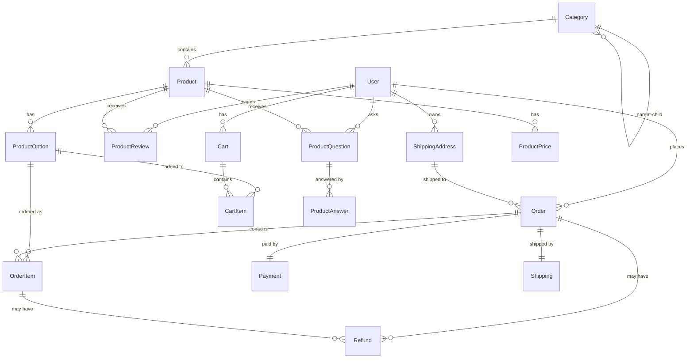

# 쇼핑몰 DB 스키마 설계서 v1.0

> 작성일: 2025-08-12  
> 작성자: Claude Code (대길 형님 지도하에)  
> 버전: 1.0.0

## 1. 스키마 개요

### 1.1 핵심 도메인
- **상품 관리**: Product, ProductOption, ProductPrice, Category
- **장바구니**: Cart, CartItem
- **주문/결제**: Order, OrderItem, Payment, Refund
- **배송**: Shipping, ShippingAddress
- **리뷰/문의**: ProductReview, ProductQuestion, ProductAnswer

### 1.2 테이블 관계도



## 2. 테이블 상세 설계

### 2.1 카테고리 (Category)
```sql
CREATE TABLE categories (
    id INT PRIMARY KEY AUTO_INCREMENT,
    parent_id INT NULL,                    -- 상위 카테고리 (NULL이면 최상위)
    name VARCHAR(100) NOT NULL,            -- 카테고리명
    slug VARCHAR(100) UNIQUE NOT NULL,     -- URL용 슬러그
    depth INT NOT NULL DEFAULT 0,          -- 계층 깊이 (0=최상위)
    sort_order INT DEFAULT 0,              -- 정렬 순서
    is_active BOOLEAN DEFAULT true,        -- 활성 여부
    created_at TIMESTAMP DEFAULT NOW(),
    updated_at TIMESTAMP NULL,
    
    FOREIGN KEY (parent_id) REFERENCES categories(id),
    INDEX idx_parent (parent_id),
    INDEX idx_slug (slug),
    INDEX idx_active_sort (is_active, sort_order)
);
```

### 2.2 상품 (Product)
```sql
CREATE TABLE products (
    id INT PRIMARY KEY AUTO_INCREMENT,
    category_id INT NOT NULL,              -- 카테고리
    name VARCHAR(255) NOT NULL,            -- 상품명
    slug VARCHAR(255) UNIQUE NOT NULL,     -- URL용 슬러그
    description TEXT,                      -- 상품 설명
    main_image VARCHAR(500),               -- 대표 이미지
    images JSON,                            -- 추가 이미지 배열
    
    -- 제품 메타정보 (JSON)
    product_info JSON,                      -- 제품 상세 정보
    /* 예시:
    {
        "ingredients": "비타민 C 1000mg, 아연 10mg...",
        "usage_instructions": "1일 1회, 1정을 식후 복용",
        "precautions": "임산부 또는 수유부는 의사와 상담 후 복용",
        "manufacturer": "바이오컴",
        "origin_country": "대한민국",
        "expiration_info": "제조일로부터 24개월",
        "storage_method": "직사광선을 피해 서늘한 곳에 보관",
        "certification": "GMP 인증"
    }
    */
    
    -- 옵션 및 가격 (JSON)
    options JSON,                           -- 상품 옵션
    /* 예시:
    [
        {"name": "30정", "price": 30000, "stock": 100, "max_order": 10},
        {"name": "60정", "price": 55000, "stock": 50, "max_order": 5},
        {"name": "90정", "price": 75000, "stock": 30, "max_order": 3}
    ]
    */
    base_price DECIMAL(10, 0) NOT NULL,    -- 기본 가격
    price_info JSON,                        -- 가격 정보 (할인/프로모션)
    /* 예시:
    {
        "discount": {"type": "PERCENT", "value": 20, "start": "2025-08-01", "end": "2025-08-31"},
        "promotion": {"type": "FIXED", "value": 5000, "start": "2025-09-01", "end": "2025-09-15"}
    }
    */
    
    -- 상태 관리
    status ENUM('ACTIVE', 'INACTIVE', 'SOLD_OUT') DEFAULT 'ACTIVE',
    is_featured BOOLEAN DEFAULT false,     -- 추천 상품 여부
    view_count INT DEFAULT 0,              -- 조회수
    
    created_at TIMESTAMP DEFAULT NOW(),
    updated_at TIMESTAMP NULL,
    
    FOREIGN KEY (category_id) REFERENCES categories(id),
    INDEX idx_category (category_id),
    INDEX idx_status (status),
    INDEX idx_featured (is_featured),
    INDEX idx_slug (slug)
);
```


### 2.3 장바구니 (Cart & CartItem)
```sql
CREATE TABLE carts (
    id INT PRIMARY KEY AUTO_INCREMENT,
    user_id INT NOT NULL,
    created_at TIMESTAMP DEFAULT NOW(),
    updated_at TIMESTAMP NULL,
    
    FOREIGN KEY (user_id) REFERENCES users(id) ON DELETE CASCADE,
    UNIQUE KEY uk_user (user_id)
);

CREATE TABLE cart_items (
    id INT PRIMARY KEY AUTO_INCREMENT,
    cart_id INT NOT NULL,
    product_id INT NOT NULL,
    option_name VARCHAR(100),              -- 옵션명 (예: "30정")
    option_price DECIMAL(10, 0),           -- 옵션 가격
    quantity INT NOT NULL DEFAULT 1,
    added_at TIMESTAMP DEFAULT NOW(),
    updated_at TIMESTAMP NULL,
    
    FOREIGN KEY (cart_id) REFERENCES carts(id) ON DELETE CASCADE,
    FOREIGN KEY (product_id) REFERENCES products(id),
    UNIQUE KEY uk_cart_product_option (cart_id, product_id, option_name),
    INDEX idx_cart (cart_id)
);
```


### 2.4 주문 (Order)
```sql
CREATE TABLE orders (
    id INT PRIMARY KEY AUTO_INCREMENT,
    order_number VARCHAR(50) UNIQUE NOT NULL,  -- 주문번호 (예: ORD20250812001)
    user_id INT NOT NULL,
    
    -- 주문 정보
    status ENUM(
        'PENDING',           -- 주문접수
        'PAID',              -- 결제완료
        'PROCESSING',        -- 처리중
        'SHIPPING',          -- 배송중
        'DELIVERED',         -- 배송완료
        'COMPLETED',         -- 구매확정
        'CANCELLED',         -- 취소
        'PARTIAL_CANCELLED'  -- 부분취소
    ) NOT NULL DEFAULT 'PENDING',
    
    -- 금액 정보
    total_product_price DECIMAL(10, 0) NOT NULL,  -- 상품 총액
    total_discount DECIMAL(10, 0) DEFAULT 0,      -- 할인 총액
    shipping_fee DECIMAL(10, 0) DEFAULT 0,        -- 배송비
    total_amount DECIMAL(10, 0) NOT NULL,         -- 최종 결제액
    
    -- 배송 정보 (JSON)
    shipping_address JSON NOT NULL,        -- 배송지 정보
    /* 예시:
    {
        "name": "집",
        "recipient_name": "홍길동",
        "recipient_phone": "010-1234-5678",
        "postal_code": "06234",
        "address": "서울특별시 강남구 테헤란로 123",
        "address_detail": "456호"
    }
    */
    buyer_name VARCHAR(100) NOT NULL,          -- 주문자 이름
    buyer_phone VARCHAR(20) NOT NULL,          -- 주문자 전화번호
    buyer_email VARCHAR(255),                  -- 주문자 이메일
    delivery_message TEXT,                     -- 배송 메시지
    
    -- 시간 정보
    ordered_at TIMESTAMP DEFAULT NOW(),        -- 주문일시
    paid_at TIMESTAMP NULL,                    -- 결제일시
    shipped_at TIMESTAMP NULL,                 -- 발송일시
    delivered_at TIMESTAMP NULL,               -- 배송완료일시
    completed_at TIMESTAMP NULL,               -- 구매확정일시
    cancelled_at TIMESTAMP NULL,               -- 취소일시
    
    created_at TIMESTAMP DEFAULT NOW(),
    updated_at TIMESTAMP NULL,
    
    FOREIGN KEY (user_id) REFERENCES users(id),
    INDEX idx_user (user_id),
    INDEX idx_status (status),
    INDEX idx_order_number (order_number),
    INDEX idx_ordered_at (ordered_at)
);
```

### 2.5 주문 상품 (OrderItem)
```sql
CREATE TABLE order_items (
    id INT PRIMARY KEY AUTO_INCREMENT,
    order_id INT NOT NULL,
    product_id INT NOT NULL,
    
    -- 주문 시점 스냅샷 (상품 정보가 변경되어도 주문 당시 정보 유지)
    product_name VARCHAR(255) NOT NULL,
    option_name VARCHAR(100),              -- 옵션명 (예: "30정")
    product_price DECIMAL(10, 0) NOT NULL,     -- 상품 단가
    quantity INT NOT NULL,                      -- 수량
    subtotal DECIMAL(10, 0) NOT NULL,          -- 소계 (단가 × 수량)
    
    -- 상태 관리 (부분취소/반품/교환)
    status ENUM(
        'ORDERED',           -- 주문됨
        'CONFIRMED',         -- 확인됨
        'PREPARING',         -- 준비중
        'SHIPPED',           -- 발송됨
        'DELIVERED',         -- 배송완료
        'CANCEL_REQUESTED',  -- 취소요청
        'CANCELLED',         -- 취소완료
        'RETURN_REQUESTED',  -- 반품요청
        'RETURNED',          -- 반품완료
        'EXCHANGE_REQUESTED',-- 교환요청
        'EXCHANGED'          -- 교환완료
    ) NOT NULL DEFAULT 'ORDERED',
    
    cancelled_at TIMESTAMP NULL,
    returned_at TIMESTAMP NULL,
    exchanged_at TIMESTAMP NULL,
    
    created_at TIMESTAMP DEFAULT NOW(),
    updated_at TIMESTAMP NULL,
    
    FOREIGN KEY (order_id) REFERENCES orders(id) ON DELETE CASCADE,
    FOREIGN KEY (product_id) REFERENCES products(id),
    INDEX idx_order (order_id),
    INDEX idx_status (status)
);
```

### 2.6 결제 (Payment)
```sql
CREATE TABLE payments (
    id INT PRIMARY KEY AUTO_INCREMENT,
    order_id INT NOT NULL,
    payment_method ENUM(
        'CARD',              -- 신용/체크카드
        'BANK_TRANSFER',     -- 무통장입금
        'VIRTUAL_ACCOUNT',   -- 가상계좌
        'NAVER_PAY',         -- 네이버페이
        'KAKAO_PAY',         -- 카카오페이
        'TOSS_PAY',          -- 토스페이
        'PAYCO',             -- 페이코
        'TEST'               -- 테스트 결제
    ) NOT NULL,
    payment_status ENUM('PENDING', 'COMPLETED', 'FAILED', 'CANCELLED') NOT NULL,
    
    -- PG사 정보
    pg_provider VARCHAR(50),               -- PG사명
    pg_transaction_id VARCHAR(100),        -- PG사 거래번호
    
    -- 결제수단별 상세정보 (JSON)
    payment_details JSON,
    /* 예시:
    카드: {"card_number": "****1234", "card_company": "신한", "installment": 0}
    무통장: {"bank": "국민은행", "account_holder": "홍길동", "due_date": "2025-08-15"}
    가상계좌: {"bank": "우리은행", "account_number": "1234567890", "due_date": "2025-08-15"}
    네이버페이: {"naver_pay_id": "NPY123456", "buyer_id": "user123"}
    카카오페이: {"kakao_pay_tid": "T123456", "buyer_id": "user456"}
    */
    
    -- 금액 정보
    amount DECIMAL(10, 0) NOT NULL,        -- 결제 금액
    
    -- 시간 정보
    paid_at TIMESTAMP NULL,
    failed_at TIMESTAMP NULL,
    cancelled_at TIMESTAMP NULL,
    
    created_at TIMESTAMP DEFAULT NOW(),
    updated_at TIMESTAMP NULL,
    
    FOREIGN KEY (order_id) REFERENCES orders(id),
    UNIQUE KEY uk_order (order_id),
    INDEX idx_status (payment_status),
    INDEX idx_pg_transaction (pg_transaction_id)
);
```

### 2.7 환불 (Refund)
```sql
CREATE TABLE refunds (
    id INT PRIMARY KEY AUTO_INCREMENT,
    order_id INT NOT NULL,
    order_item_id INT NULL,                -- NULL이면 전체 환불, 값이 있으면 부분 환불
    
    refund_type ENUM('CANCEL', 'RETURN') NOT NULL,  -- 취소, 반품
    refund_status ENUM('REQUESTED', 'APPROVED', 'COMPLETED', 'REJECTED') NOT NULL,
    refund_amount DECIMAL(10, 0) NOT NULL, -- 환불 금액
    refund_reason VARCHAR(500),            -- 환불 사유
    refund_method VARCHAR(20),             -- 환불 방법 (원결제수단, 포인트 등)
    
    -- PG사 환불 정보
    pg_refund_id VARCHAR(100),             -- PG사 환불번호
    
    -- 시간 정보
    requested_at TIMESTAMP DEFAULT NOW(),  -- 요청일시
    approved_at TIMESTAMP NULL,            -- 승인일시
    completed_at TIMESTAMP NULL,           -- 완료일시
    rejected_at TIMESTAMP NULL,            -- 거절일시
    
    admin_memo TEXT,                       -- 관리자 메모
    
    created_at TIMESTAMP DEFAULT NOW(),
    updated_at TIMESTAMP NULL,
    
    FOREIGN KEY (order_id) REFERENCES orders(id),
    FOREIGN KEY (order_item_id) REFERENCES order_items(id),
    INDEX idx_order (order_id),
    INDEX idx_status (refund_status),
    INDEX idx_requested_at (requested_at)
);
```

### 2.8 배송 (Shipping)
```sql
CREATE TABLE shippings (
    id INT PRIMARY KEY AUTO_INCREMENT,
    order_id INT NOT NULL,
    
    shipping_company VARCHAR(100),         -- 택배사
    tracking_number VARCHAR(100),          -- 송장번호
    shipping_status ENUM('PREPARING', 'SHIPPED', 'IN_TRANSIT', 'DELIVERED') NOT NULL,
    shipping_fee DECIMAL(10, 0) DEFAULT 0, -- 배송비
    
    -- 배송 정보 스냅샷
    recipient_name VARCHAR(100) NOT NULL,
    recipient_phone VARCHAR(20) NOT NULL,
    postal_code VARCHAR(10) NOT NULL,
    address VARCHAR(255) NOT NULL,
    address_detail VARCHAR(255),
    delivery_message TEXT,
    
    -- 시간 정보
    shipped_at TIMESTAMP NULL,             -- 발송일시
    delivered_at TIMESTAMP NULL,           -- 배송완료일시
    
    created_at TIMESTAMP DEFAULT NOW(),
    updated_at TIMESTAMP NULL,
    
    FOREIGN KEY (order_id) REFERENCES orders(id),
    UNIQUE KEY uk_order (order_id),
    INDEX idx_tracking (tracking_number),
    INDEX idx_status (shipping_status)
);
```

### 2.9 상품 리뷰 (ProductReview)
```sql
CREATE TABLE product_reviews (
    id INT PRIMARY KEY AUTO_INCREMENT,
    product_id INT NOT NULL,
    user_id INT NOT NULL,
    order_item_id INT NOT NULL,            -- 구매 확인용
    
    rating INT NOT NULL CHECK (rating >= 1 AND rating <= 5),  -- 별점 (1~5)
    title VARCHAR(200),                    -- 리뷰 제목
    content TEXT NOT NULL,                  -- 리뷰 내용
    images JSON,                            -- 리뷰 이미지 배열
    
    is_verified_purchase BOOLEAN DEFAULT true,  -- 구매 인증
    helpful_count INT DEFAULT 0,           -- 도움됨 수
    unhelpful_count INT DEFAULT 0,         -- 도움안됨 수
    
    created_at TIMESTAMP DEFAULT NOW(),
    updated_at TIMESTAMP NULL,
    
    FOREIGN KEY (product_id) REFERENCES products(id) ON DELETE CASCADE,
    FOREIGN KEY (user_id) REFERENCES users(id),
    FOREIGN KEY (order_item_id) REFERENCES order_items(id),
    UNIQUE KEY uk_order_item (order_item_id),  -- 주문 상품당 리뷰 1개
    INDEX idx_product_rating (product_id, rating),
    INDEX idx_user (user_id),
    INDEX idx_created_at (created_at DESC)
);
```

### 2.10 상품 문의 (ProductQuestion)
```sql
CREATE TABLE product_questions (
    id INT PRIMARY KEY AUTO_INCREMENT,
    product_id INT NOT NULL,
    user_id INT NOT NULL,
    
    -- 문의 내용
    title VARCHAR(200) NOT NULL,           -- 문의 제목
    content TEXT NOT NULL,                 -- 문의 내용
    is_secret BOOLEAN DEFAULT false,       -- 비밀글 여부
    
    -- 답변 내용 (답변이 있을 경우)
    answer_content TEXT NULL,              -- 답변 내용
    admin_id INT NULL,                     -- 답변한 관리자
    answered_at TIMESTAMP NULL,            -- 답변 일시
    
    created_at TIMESTAMP DEFAULT NOW(),
    updated_at TIMESTAMP NULL,
    
    FOREIGN KEY (product_id) REFERENCES products(id) ON DELETE CASCADE,
    FOREIGN KEY (user_id) REFERENCES users(id),
    FOREIGN KEY (admin_id) REFERENCES users(id),
    INDEX idx_product (product_id),
    INDEX idx_user (user_id),
    INDEX idx_created_at (created_at DESC),
    INDEX idx_answered (answered_at)
);
```

## 3. 배송비 정책 구현

### 3.1 배송비 계산 로직
```sql
-- 배송비 정책 테이블 (선택적)
CREATE TABLE shipping_policies (
    id INT PRIMARY KEY AUTO_INCREMENT,
    name VARCHAR(100) NOT NULL,
    base_fee DECIMAL(10, 0) DEFAULT 3000,      -- 기본 배송비
    free_shipping_amount DECIMAL(10, 0) DEFAULT 50000,  -- 무료배송 기준 금액
    island_additional_fee DECIMAL(10, 0) DEFAULT 3000,  -- 제주/도서산간 추가비
    is_active BOOLEAN DEFAULT true,
    created_at TIMESTAMP DEFAULT NOW()
);
```

### 3.2 배송비 계산 함수 (애플리케이션 레벨)
```typescript
function calculateShippingFee(
    totalAmount: number,
    postalCode: string
): number {
    const BASE_FEE = 3000;
    const FREE_SHIPPING_AMOUNT = 50000;
    const ISLAND_ADDITIONAL_FEE = 3000;
    
    // 제주/도서산간 지역 체크
    const isIslandArea = postalCode.startsWith('63'); // 제주
    
    if (totalAmount >= FREE_SHIPPING_AMOUNT) {
        return isIslandArea ? ISLAND_ADDITIONAL_FEE : 0;
    }
    
    return BASE_FEE + (isIslandArea ? ISLAND_ADDITIONAL_FEE : 0);
}
```

## 4. 인덱스 전략

### 4.1 자주 사용되는 쿼리 최적화
- 상품 목록: `category_id`, `status`, `is_featured`
- 주문 조회: `user_id`, `status`, `ordered_at`
- 장바구니: `user_id`, `product_option_id`
- 리뷰: `product_id`, `rating`, `created_at`

### 4.2 복합 인덱스
```sql
-- 상품 목록 조회 최적화
CREATE INDEX idx_product_list ON products(category_id, status, created_at DESC);

-- 주문 내역 조회 최적화
CREATE INDEX idx_order_history ON orders(user_id, status, ordered_at DESC);

-- 상품 리뷰 조회 최적화
CREATE INDEX idx_review_list ON product_reviews(product_id, created_at DESC);
```

## 5. 트리거 및 제약사항

### 5.1 재고 관리 트리거
```sql
-- 주문 시 재고 차감
DELIMITER $$
CREATE TRIGGER decrease_stock_on_order
AFTER INSERT ON order_items
FOR EACH ROW
BEGIN
    UPDATE product_options 
    SET stock_quantity = stock_quantity - NEW.quantity
    WHERE id = NEW.product_option_id;
END$$
DELIMITER ;

-- 취소 시 재고 복구
DELIMITER $$
CREATE TRIGGER restore_stock_on_cancel
AFTER UPDATE ON order_items
FOR EACH ROW
BEGIN
    IF NEW.status = 'CANCELLED' AND OLD.status != 'CANCELLED' THEN
        UPDATE product_options 
        SET stock_quantity = stock_quantity + NEW.quantity
        WHERE id = NEW.product_option_id;
    END IF;
END$$
DELIMITER ;
```

### 5.2 리뷰 평점 자동 계산
```sql
-- 상품 테이블에 평점 필드 추가
ALTER TABLE products ADD COLUMN average_rating DECIMAL(2,1) DEFAULT 0;
ALTER TABLE products ADD COLUMN review_count INT DEFAULT 0;

-- 리뷰 작성 시 평점 업데이트
DELIMITER $$
CREATE TRIGGER update_product_rating
AFTER INSERT ON product_reviews
FOR EACH ROW
BEGIN
    UPDATE products 
    SET average_rating = (
        SELECT AVG(rating) FROM product_reviews WHERE product_id = NEW.product_id
    ),
    review_count = (
        SELECT COUNT(*) FROM product_reviews WHERE product_id = NEW.product_id
    )
    WHERE id = NEW.product_id;
END$$
DELIMITER ;
```

## 6. 보안 고려사항

### 6.1 개인정보 암호화
- `shipping_addresses`: recipient_name, recipient_phone 암호화
- `orders`: buyer_name, buyer_phone 암호화
- `payments`: card_number는 마지막 4자리만 저장

### 6.2 접근 제어
- 상품 문의 비밀글: 작성자와 관리자만 조회 가능
- 주문 정보: 본인 주문만 조회 가능
- 리뷰: 구매 확인 후 작성 가능

## 7. 마이그레이션 고려사항

### 7.1 Prisma 스키마 통합
- 기존 User 테이블과 연동
- 기존 FileUpload 테이블 활용 (상품 이미지, 리뷰 이미지)
- 기존 PointHistory와 연동 (추후 포인트 결제 시)

### 7.2 단계별 구현 계획
1. **Phase 1**: 카테고리, 상품, 상품옵션, 가격
2. **Phase 2**: 장바구니, 주문, 결제, 배송
3. **Phase 3**: 리뷰, Q&A
4. **Phase 4**: 쿠폰, 포인트 결제 (추후)

---

*이 문서는 지속적으로 업데이트됩니다.*  
*최종 수정: 2025-08-12 by Claude Code*