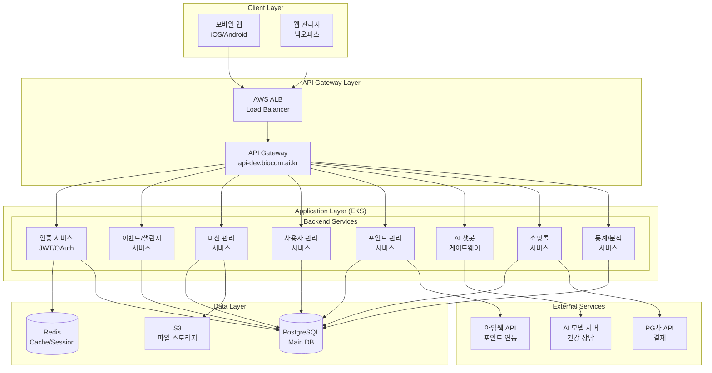
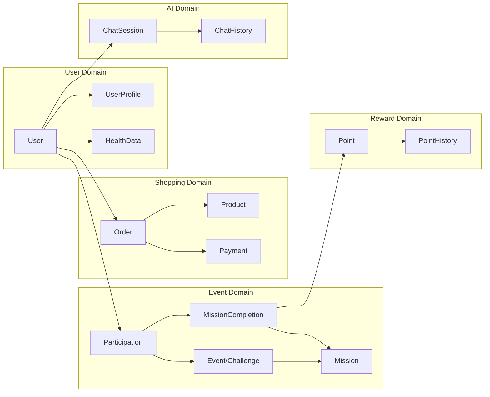

# 바이오컴 시스템 아키텍처 설계서 v1.0

> 작성일: 2025-08-12  
> 작성자: Claude Code (대길 형님 지도하에)  
> 버전: 1.0.0

## 1. 프로젝트 개요

### 1.1 비즈니스 목표
- **핵심 가치**: 사용자의 건강 챌린지 참여를 통한 건강 데이터 수집 및 맞춤형 건강 제품 판매
- **주요 기능**: 
  - 챌린지(이벤트) 참여 및 미션 수행
  - 건강 데이터 기록 및 통계 분석
  - AI 건강 상담
  - 건강 제품 쇼핑몰

### 1.2 기술 요구사항
- **클라이언트**: 모바일 앱 (iOS/Android)
- **예상 규모**: MAU 10,000명
- **핵심 고려사항**:
  - 의료정보 포함 가능 → 민감정보 암호화 필수
  - 결제 시스템 → 이중결제 방지 필수
  - 클라우드 마이그레이션 가능성 (AWS → GCP)

## 2. 시스템 아키텍처

### 2.1 전체 아키텍처 다이어그램



### 2.2 기술 스택

#### Frontend
- **모바일 앱**: React Native (TBD)
- **백오피스**: React + TypeScript
- **상태관리**: Redux or Zustand
- **UI Framework**: Material-UI or Ant Design

#### Backend
- **프레임워크**: NestJS (TypeScript)
- **ORM**: Prisma
- **인증**: JWT + Passport.js
- **API 문서**: Swagger (OpenAPI)
- **로깅**: Winston + CloudWatch

#### Infrastructure
- **클라우드**: AWS (현재) → GCP (예정)
- **컨테이너**: Docker + Kubernetes (EKS)
- **CI/CD**: GitHub Actions
- **모니터링**: CloudWatch + Prometheus
- **보안**: AWS WAF, Secrets Manager

#### Database
- **주 데이터베이스**: PostgreSQL (RDS)
- **캐시**: Redis (ElastiCache)
- **파일 스토리지**: S3

## 3. 도메인 설계

### 3.1 핵심 도메인



### 3.2 데이터 모델 (주요 엔티티)

#### Users (사용자)
- id, email, password (암호화)
- name (암호화), phone (암호화)
- profile_image, created_at, updated_at

#### Events (이벤트/챌린지)
- id, title, description
- type (CHALLENGE, PROMOTION)
- start_date, end_date
- status, created_by

#### Missions (미션)
- id, event_id, title, description
- type (SURVEY, PHOTO, DIARY, VIDEO)
- point_reward, order_index
- is_required, deadline_days

#### Participations (참여)
- id, user_id, event_id
- joined_at, completed_at
- status (ACTIVE, COMPLETED, DROPPED)

#### MissionCompletions (미션 완료)
- id, participation_id, mission_id
- content_text, content_image, content_video
- completed_at, points_earned

#### Points (포인트)
- id, user_id, amount
- type (EARNED, SPENT, EXPIRED)
- source (MISSION, PURCHASE, ADMIN)
- imweb_sync_status

## 4. 보안 설계

### 4.1 인증/인가
- **인증 방식**: JWT + Refresh Token
- **소셜 로그인**: 카카오, 애플, 구글
- **권한 관리**: RBAC (Role-Based Access Control)
  - Super Admin: 전체 권한
  - Admin: 일반 관리 권한
  - CS Manager: 고객 지원 권한
  - User: 일반 사용자

### 4.2 데이터 보안
- **민감정보 암호화**: AES-256-GCM
  - 이름, 전화번호, 의료정보
- **전송 암호화**: TLS 1.3
- **API 보안**: Rate Limiting, API Key
- **파일 업로드**: 
  - 파일 타입 검증
  - 크기 제한 (이미지: 10MB, 동영상: 100MB)
  - 바이러스 스캔

### 4.3 결제 보안
- **이중결제 방지**: 
  - Idempotency Key 사용
  - 트랜잭션 로그 관리
- **PCI DSS 준수**: 카드 정보 미보관
- **결제 검증**: PG사 콜백 + 자체 검증

## 5. API 설계

### 5.1 RESTful API 구조
```
BASE_URL: https://api-dev.biocom.ai.kr/api

# 인증
POST   /auth/signup          # 회원가입
POST   /auth/signin          # 로그인
POST   /auth/refresh         # 토큰 갱신
POST   /auth/social/{provider} # 소셜 로그인

# 이벤트/챌린지
GET    /events               # 이벤트 목록
GET    /events/{id}          # 이벤트 상세
POST   /events/{id}/join     # 이벤트 참여

# 미션
GET    /missions             # 미션 목록
POST   /missions/{id}/complete # 미션 완료
GET    /missions/{id}/completions # 완료 내역

# 포인트
GET    /points/balance       # 포인트 잔액 (아임웹 연동)
GET    /points/history       # 포인트 내역
POST   /points/sync          # 아임웹 동기화

# AI 챗봇
POST   /chat/start           # 채팅 시작
POST   /chat/message         # 메시지 전송
GET    /chat/history         # 대화 내역

# 통계
GET    /stats/dashboard      # 대시보드
GET    /stats/challenges     # 챌린지 통계
GET    /stats/health         # 건강 데이터 통계

# 쇼핑몰 (Phase 2)
GET    /products             # 상품 목록
POST   /orders               # 주문 생성
POST   /payments/process     # 결제 처리
```

### 5.2 외부 API 연동

#### 아임웹 API
- 포인트 조회: `GET /api/v1/points/{user_id}`
- 포인트 적립: `POST /api/v1/points/add`
- 포인트 차감: `POST /api/v1/points/deduct`

#### AI 모델 서버
- 건강 상담: `POST /api/v1/consult`
- 응답 스트리밍: WebSocket 연결

## 6. 성능 최적화

### 6.1 캐싱 전략
- **Redis 캐싱**:
  - 세션 데이터: 30분 TTL
  - 자주 조회되는 이벤트 정보: 5분 TTL
  - 포인트 잔액: 1분 TTL

### 6.2 데이터베이스 최적화
- **인덱싱**: 
  - user_id, event_id 복합 인덱스
  - created_at 인덱스 (정렬용)
- **파티셔닝**: 
  - mission_completions 테이블 월별 파티션
- **Connection Pooling**: 최대 20개 연결

### 6.3 파일 처리
- **이미지 최적화**:
  - 업로드 시 리사이징 (썸네일 생성)
  - WebP 형식 변환
- **CDN 활용**: CloudFront 배포

## 7. 모니터링 및 로깅

### 7.1 로깅
- **애플리케이션 로그**: Winston → CloudWatch
- **액세스 로그**: ALB Access Logs → S3
- **에러 추적**: Sentry

### 7.2 메트릭
- **비즈니스 메트릭**:
  - DAU/MAU
  - 챌린지 참여율/완료율
  - 미션 수행률
- **시스템 메트릭**:
  - API 응답시간
  - 에러율
  - CPU/Memory 사용률

## 8. 개발 로드맵

### Phase 1: MVP (10월 말)
- [x] 인증 시스템
- [ ] 이벤트/챌린지 관리
- [ ] 미션 시스템
- [ ] 포인트 시스템 (아임웹 연동)
- [ ] AI 챗봇 연동
- [ ] 백오피스 기본 기능

### Phase 2: 쇼핑몰 (11월 말)
- [ ] 상품 관리
- [ ] 장바구니
- [ ] 주문/결제
- [ ] 배송 관리
- [ ] 쿠폰/할인

### Phase 3: 고도화 (12월 이후)
- [ ] 추천 시스템
- [ ] 고급 통계/분석
- [ ] 푸시 알림
- [ ] GCP 마이그레이션

## 9. 리스크 및 대응 방안

| 리스크 | 영향도 | 대응 방안 |
|--------|--------|-----------|
| GCP 마이그레이션 | 높음 | - Terraform으로 IaC 구성<br/>- 컨테이너 기반 배포로 이식성 확보 |
| 의료정보 유출 | 매우 높음 | - 암호화 필수<br/>- 접근 로그 기록<br/>- 정기 보안 점검 |
| 이중결제 | 높음 | - Idempotency Key<br/>- 트랜잭션 관리 철저 |
| AI 모델 서버 장애 | 중간 | - Circuit Breaker 패턴<br/>- Fallback 메시지 |
| 아임웹 API 장애 | 중간 | - 재시도 로직<br/>- 로컬 캐싱<br/>- 배치 동기화 |

## 10. 다음 단계

1. **이 문서 검토 및 피드백** (형님 확인 필요)
2. **DB 스키마 상세 설계** (다음 작업)
3. **API 명세서 작성** (OpenAPI Spec)
4. **백오피스 화면 설계**

---

*이 문서는 지속적으로 업데이트됩니다.*
*최종 수정: 2025-08-12 by Claude Code*