# 바이오컴 API 전체 시스템 ERD

## 전체 Entity Relationship Diagram

```mermaid
erDiagram
    %% 사용자 및 인증 시스템
    USERS ||--o{ EVENT_USERS : "참여"
    USERS ||--o{ FILE_UPLOADS : "업로드"
    USERS ||--o{ POINT_HISTORIES : "포인트내역"
    USERS ||--o{ SURVEY_ANSWERS : "답변(하위호환)"
    
    %% 이벤트 시스템
    EVENT_PERIODS ||--o{ EVENT_USERS : "참여"
    EVENT_PERIODS ||--o{ EVENT_MISSIONS : "포함"
    EVENT_PERIODS ||--o{ EVENT_SURVEYS : "포함"
    EVENT_PERIODS ||--o{ EVENT_QUIZZES : "포함"
    
    %% 이벤트 참여 관계
    EVENT_USERS ||--o{ SURVEY_ANSWERS : "답변"
    EVENT_USERS ||--o{ MISSION_COMPLETIONS : "수행"
    EVENT_USERS ||--o{ QUIZ_ANSWERS : "답변"
    
    %% 미션 시스템
    MISSIONS ||--o{ EVENT_MISSIONS : "속함"
    MISSIONS ||--o{ MISSION_SCHEDULES : "일정"
    EVENT_MISSIONS ||--o{ MISSION_COMPLETIONS : "완료"
    
    %% 설문 시스템
    SURVEYS ||--o{ EVENT_SURVEYS : "속함"
    SURVEYS ||--o{ SURVEY_QUESTIONS : "포함"
    SURVEY_QUESTIONS ||--o{ SURVEY_ANSWERS : "답변"
    SURVEY_OPTIONS ||--o{ SURVEY_ANSWERS : "선택"
    
    %% 퀴즈 시스템
    EVENT_QUIZZES ||--o{ QUIZ_ANSWERS : "답변"
    
    %% 파일 업로드
    FILE_UPLOADS ||--o{ MISSION_COMPLETIONS : "인증"
    
    %% 독립 테이블
    CATEGORY_DETAILS
    IMWEB_INFO
    
    USERS {
        int id PK "사용자ID"
        string email UK "이메일"
        string password "비밀번호(해시)"
        string name "이름"
        string mobile "휴대폰"
        int points "보유포인트"
        datetime created_at "가입일시"
        datetime updated_at "수정일시"
    }
    
    FILE_UPLOADS {
        int id PK "파일ID"
        int user_id FK "사용자ID"
        string original_name "원본파일명"
        string filename "저장파일명"
        string mimetype "MIME타입"
        int size "파일크기(bytes)"
        string path "저장경로"
        datetime uploaded_at "업로드일시"
        string file_type "파일타입"
        string upload_category "업로드분류"
    }
    
    POINT_HISTORIES {
        int id PK "내역ID"
        int user_id FK "사용자ID"
        string type "타입(EARN,USE,EXPIRE)"
        int amount "포인트양(+/-)"
        int balance "잔액"
        string description "설명"
        string related_type "관련타입"
        int related_id "관련ID"
        datetime created_at "생성일시"
    }
    
    EVENT_PERIODS {
        int id PK "이벤트ID"
        string type "이벤트타입(EVENT,SURVEY,PROMOTION,CHALLENGE)"
        string name "이벤트명"
        date start_date "시작일"
        date end_date "종료일"
        int total_days "총일수(기본21일)"
        boolean is_active "활성화여부"
        string description "설명"
        datetime created_at "생성일시"
        datetime updated_at "수정일시"
    }
    
    EVENT_USERS {
        int id PK "ID"
        int event_id FK "이벤트ID"
        int user_id FK "사용자ID"
        datetime joined_at "참여일시"
        string status "상태(ACTIVE,COMPLETED)"
        datetime completed_at "완료일시"
        int total_points "총포인트"
        int completed_days "완료일수"
        datetime created_at "생성일시"
        datetime updated_at "수정일시"
    }
    
    MISSIONS {
        int id PK "미션ID"
        string code UK "미션코드"
        string name "미션명"
        string description "설명"
        int points "기본포인트"
        boolean require_upload "업로드필수여부"
        int sort_order "정렬순서"
        boolean is_active "활성화여부"
        string category "카테고리(DAILY)"
        int daily_limit "일일제한"
        int specific_day "특정일차"
        int total_days "총일수"
        string upload_type "업로드타입"
        datetime created_at "생성일시"
        datetime updated_at "수정일시"
    }
    
    MISSION_SCHEDULES {
        int id PK "ID"
        int mission_id FK "미션ID"
        int day "일차"
        string title "제목"
        string description "설명"
        string type "타입(DAILY_MISSION,QUIZ,CONTENT)"
        json data "상세데이터"
        int points "포인트"
        datetime created_at "생성일시"
        datetime updated_at "수정일시"
    }
    
    EVENT_MISSIONS {
        int id PK "ID"
        int event_id FK "이벤트ID"
        int mission_id FK "미션ID"
        int points "포인트"
        int active_from_day "시작일차"
        int active_to_day "종료일차"
        boolean is_active "활성화여부"
        int sort_order "정렬순서"
        datetime created_at "생성일시"
        datetime updated_at "수정일시"
    }
    
    MISSION_COMPLETIONS {
        int id PK "ID"
        int event_user_id FK "이벤트참여자ID"
        int event_mission_id FK "이벤트미션ID"
        int day "수행일차"
        datetime completed_at "완료일시"
        int points_earned "획득포인트"
        int file_upload_id FK "인증파일ID"
        datetime created_at "생성일시"
        datetime updated_at "수정일시"
    }
    
    SURVEYS {
        int id PK "설문ID"
        string name "설문명"
        string description "설명"
        boolean is_active "활성화여부"
        datetime created_at "생성일시"
        datetime updated_at "수정일시"
    }
    
    SURVEY_QUESTIONS {
        int id PK "질문ID"
        int survey_id FK "설문ID(null:공통질문)"
        string category "카테고리"
        string question_text "질문내용"
        int sort_order "정렬순서"
        string category_code "카테고리코드(SKIN_HEALTH등)"
        datetime created_at "생성일시"
        datetime updated_at "수정일시"
    }
    
    SURVEY_OPTIONS {
        int id PK "옵션ID"
        string option_text "선택지내용"
        int score "점수"
        datetime created_at "생성일시"
    }
    
    EVENT_SURVEYS {
        int id PK "ID"
        int event_id FK "이벤트ID"
        int survey_id FK "설문ID"
        json survey_options "설문옵션(type:before/after,fromDay)"
        boolean is_active "활성화여부"
        datetime created_at "생성일시"
        datetime updated_at "수정일시"
    }
    
    SURVEY_ANSWERS {
        int id PK "답변ID"
        int user_id FK "사용자ID(하위호환)"
        int event_user_id FK "이벤트참여자ID"
        int survey_option_id FK "선택옵션ID"
        int survey_question_id FK "질문ID"
        string type "설문타입(before/after)"
        datetime created_at "생성일시"
        datetime updated_at "수정일시"
    }
    
    EVENT_QUIZZES {
        int id PK "퀴즈ID"
        int event_id FK "이벤트ID"
        int day "출제일차"
        string question "문제"
        json options "선택지배열"
        int correct_answer "정답번호"
        int points "포인트(기본50)"
        boolean is_active "활성화여부"
        datetime created_at "생성일시"
        datetime updated_at "수정일시"
    }
    
    QUIZ_ANSWERS {
        int id PK "ID"
        int event_user_id FK "이벤트참여자ID"
        int event_quiz_id FK "이벤트퀴즈ID"
        int selected_answer "선택답안"
        boolean is_correct "정답여부"
        int points_earned "획득포인트"
        datetime answered_at "답변일시"
        datetime created_at "생성일시"
        datetime updated_at "수정일시"
    }
    
    CATEGORY_DETAILS {
        int id PK "ID"
        string category_code UK "카테고리코드"
        string category_type "카테고리타입"
        string animal_character "동물캐릭터"
        string character_keyword "캐릭터키워드"
        string detailed_features "상세특징"
        datetime created_at "생성일시"
        datetime updated_at "수정일시"
    }
    
    IMWEB_INFO {
        int id PK "ID"
        string name "사이트명"
        string client_id "클라이언트ID"
        string client_secret "클라이언트시크릿"
        string site_code UK "사이트코드"
        string redirect_uri "콜백URI"
        string scope "권한범위"
        string access_token "액세스토큰"
        string refresh_token "리프레시토큰"
        datetime created_at "생성일시"
        datetime updated_at "수정일시"
    }
```

## 시스템별 테이블 분류

### 1. 사용자 및 인증 시스템
- **USERS**: 사용자 기본 정보
- **FILE_UPLOADS**: 파일 업로드 관리
- **POINT_HISTORIES**: 포인트 이력 관리

### 2. 이벤트 관리 시스템
- **EVENT_PERIODS**: 이벤트 마스터
- **EVENT_USERS**: 이벤트 참여자
- **EVENT_MISSIONS**: 이벤트-미션 매핑
- **EVENT_SURVEYS**: 이벤트-설문 매핑
- **EVENT_QUIZZES**: 이벤트별 퀴즈

### 3. 미션 시스템
- **MISSIONS**: 미션 마스터
- **MISSION_SCHEDULES**: 일차별 미션 일정
- **MISSION_COMPLETIONS**: 미션 수행 기록

### 4. 설문 시스템
- **SURVEYS**: 설문 마스터
- **SURVEY_QUESTIONS**: 설문 질문
- **SURVEY_OPTIONS**: 공통 선택지
- **SURVEY_ANSWERS**: 설문 답변

### 5. 퀴즈 시스템
- **QUIZ_ANSWERS**: 퀴즈 답변 기록

### 6. 기타 시스템
- **CATEGORY_DETAILS**: 카테고리별 캐릭터 정보
- **IMWEB_INFO**: 아임웹 연동 정보

## 데이터 흐름 요약

### 사용자 여정
1. **회원가입**: USERS 생성
2. **이벤트 참여**: EVENT_USERS 생성
3. **활동 수행**:
   - 설문: SURVEY_ANSWERS
   - 미션: MISSION_COMPLETIONS (+ FILE_UPLOADS)
   - 퀴즈: QUIZ_ANSWERS
4. **포인트 획득**: POINT_HISTORIES 기록
5. **통계 집계**: EVENT_USERS 업데이트

### 관리자 플로우
1. **이벤트 생성**: EVENT_PERIODS
2. **구성요소 설정**:
   - 미션 연결: EVENT_MISSIONS
   - 설문 연결: EVENT_SURVEYS
   - 퀴즈 등록: EVENT_QUIZZES
3. **모니터링**: 참여 현황, 완료율 등 통계

## 주요 특징

### 1. 확장성
- 이벤트 타입 추가 가능
- 새로운 활동 유형 추가 용이
- 관계 테이블을 통한 유연한 조합

### 2. 데이터 무결성
- 모든 활동이 EVENT_USERS와 연결
- 명확한 외래키 관계
- 중복 데이터 최소화

### 3. 하위 호환성
- SURVEY_ANSWERS의 user_id 유지
- 기존 데이터와의 호환성 보장

### 4. 통계 및 분석
- 이벤트별, 사용자별, 활동별 통계 가능
- 포인트 이력 추적
- 참여율, 완료율 등 KPI 측정 용이