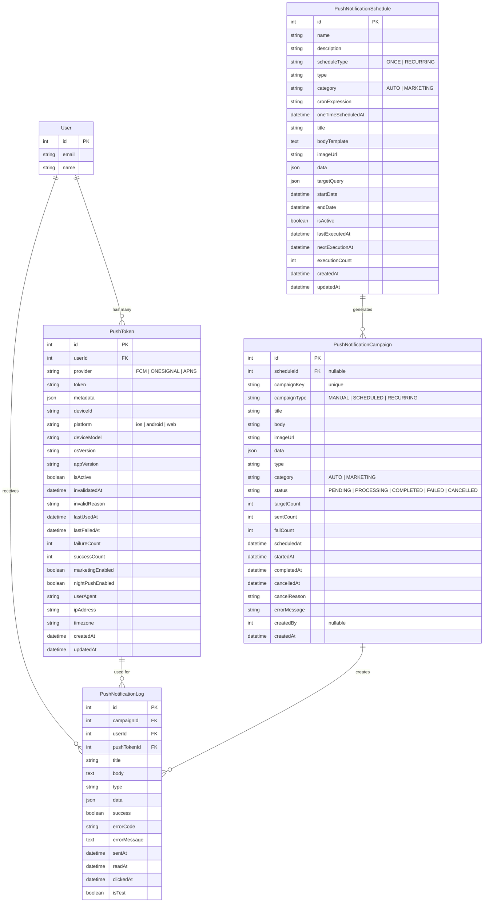

# 푸시 시스템 ERD

## 개요

Biocom 푸시 알림 시스템의 데이터베이스 구조를 설명합니다.

---

## ERD 다이어그램



---

## 테이블 상세 설명

### 1. PushToken

**목적**: 사용자의 푸시 토큰 관리

**주요 특징**:
- 다중 디바이스 지원 (한 유저가 여러 토큰 보유 가능)
- Provider 구분 (FCM, OneSignal, APNS 등)
- 토큰 생명주기 관리 (활성화/비활성화)
- 발송 통계 추적 (성공/실패 횟수)

**유니크 제약**:
```sql
UNIQUE(userId, deviceId, provider)
```
→ 같은 유저, 같은 디바이스, 같은 Provider는 토큰 1개만 유지

**인덱스**:
- `userId` - 유저별 토큰 조회
- `provider` - Provider별 필터링
- `isActive` - 활성 토큰만 조회
- `platform` - 플랫폼별 통계

**외래키 제약**:
- `userId` → `User.id` (CASCADE)
  - 유저 삭제 시 토큰도 함께 삭제

---

### 2. PushNotificationLog

**목적**: 개별 푸시 발송 이력 추적

**주요 특징**:
- 발송 성공/실패 추적
- 사용자 반응 추적 (읽음/클릭)
- 에러 정보 저장
- 캠페인별 그룹핑

**유니크 제약**:
```sql
UNIQUE(campaignId, userId)
```
→ 한 캠페인에서 한 유저에게 중복 발송 방지

**인덱스**:
- `userId` - 유저별 로그 조회
- `campaignId` - 캠페인별 로그 조회
- `pushTokenId` - 토큰별 발송 이력
- `type` - 푸시 타입별 필터링
- `success` - 성공/실패 통계
- `sentAt` - 시간순 정렬
- `isTest` - 테스트 발송 제외

**외래키 제약**:
- `userId` → `User.id` (CASCADE)
  - 유저 삭제 시 로그도 삭제
- `pushTokenId` → `PushToken.id` (SET NULL)
  - 토큰 삭제 시 로그는 유지하되 참조만 제거
- `campaignId` → `PushNotificationCampaign.id` (SET NULL)
  - 캠페인 삭제 시 로그는 유지

---

### 3. PushNotificationCampaign

**목적**: 대량 발송 캠페인 관리

**주요 특징**:
- 타겟팅 쿼리 (특정 유저 그룹 선택)
- 발송 상태 추적 (PENDING → IN_PROGRESS → COMPLETED)
- 발송 통계 (전송/성공/실패 수)
- 예약 발송 지원

**상태 흐름**:
```
PENDING → IN_PROGRESS → COMPLETED
                    ↘ FAILED
                    ↘ CANCELLED
```

**인덱스**:
- `status` - 상태별 캠페인 조회
- `category` - 카테고리별 필터링
- `scheduledAt` - 예약 시간 정렬
- `createdAt` - 생성 시간 정렬

---

### 4. PushNotificationSchedule

**목적**: 반복/예약 발송 스케줄 관리

**주요 특징**:
- 반복 발송 (Cron 표현식)
- 단발 예약 발송
- 메시지 템플릿 저장
- 타겟팅 쿼리

**스케줄 타입**:
- `ONCE`: 단발성 (oneTimeScheduledAt 사용)
- `RECURRING`: 반복 (cronExpression 사용)

**Cron 예시**:
```
0 9 * * *     - 매일 오전 9시
0 9 * * 1     - 매주 월요일 오전 9시
0 0 1 * *     - 매월 1일 자정
```

**인덱스**:
- `isActive` - 활성 스케줄만 조회
- `scheduleType` - 타입별 필터링
- `category` - 카테고리별 필터링
- `nextExecutionAt` - 다음 실행 시간 정렬
- `createdAt` - 생성 시간 정렬

---

## 데이터 관계

### 1. User ↔ PushToken (1:N)

```typescript
// 한 유저가 여러 디바이스에서 앱 사용
User {
  id: 1,
  email: "user@example.com"
}
  ↓
PushToken [
  { id: 1, userId: 1, platform: "ios", deviceId: "iPhone12" },
  { id: 2, userId: 1, platform: "android", deviceId: "GalaxyS23" }
]
```

### 2. PushToken ↔ PushNotificationLog (1:N)

```typescript
// 한 토큰으로 여러 번 발송
PushToken {
  id: 1,
  token: "fcm_abc123..."
}
  ↓
PushNotificationLog [
  { id: 1, pushTokenId: 1, title: "Welcome", sentAt: "2025-01-01" },
  { id: 2, pushTokenId: 1, title: "Event", sentAt: "2025-01-02" }
]
```

### 3. Schedule ↔ Campaign (1:N)

```typescript
// 한 스케줄이 여러 번 실행되어 여러 캠페인 생성
PushNotificationSchedule {
  id: 1,
  name: "Daily Morning Reminder",
  cronExpression: "0 9 * * *", // 매일 오전 9시
  scheduleType: "RECURRING"
}
  ↓
PushNotificationCampaign [
  { id: 1, scheduleId: 1, createdAt: "2025-11-01T09:00:00Z" },
  { id: 2, scheduleId: 1, createdAt: "2025-11-02T09:00:00Z" },
  { id: 3, scheduleId: 1, createdAt: "2025-11-03T09:00:00Z" }
  // ... 매일 생성
]
```

### 4. Campaign ↔ Log (1:N)

```typescript
// 한 캠페인이 여러 유저에게 발송
PushNotificationCampaign {
  id: 1,
  scheduleId: 1,
  title: "Good Morning!",
  targetCount: 1000
}
  ↓
PushNotificationLog [
  { id: 1, campaignId: 1, userId: 1, success: true },
  { id: 2, campaignId: 1, userId: 2, success: true },
  // ... 998개 더
]
```

---

## 주요 쿼리 패턴

### 1. 유저의 활성 토큰 조회

```sql
SELECT * FROM push_tokens
WHERE user_id = :userId
  AND is_active = true
ORDER BY created_at DESC;
```

### 2. 캠페인 발송 통계

```sql
SELECT
  campaign_id,
  COUNT(*) as total_sent,
  SUM(CASE WHEN success = true THEN 1 ELSE 0 END) as success_count,
  SUM(CASE WHEN success = false THEN 1 ELSE 0 END) as failure_count,
  SUM(CASE WHEN read_at IS NOT NULL THEN 1 ELSE 0 END) as read_count,
  SUM(CASE WHEN clicked_at IS NOT NULL THEN 1 ELSE 0 END) as click_count
FROM push_notification_logs
WHERE campaign_id = :campaignId
GROUP BY campaign_id;
```

### 3. 최근 실패한 토큰 조회

```sql
SELECT * FROM push_tokens
WHERE is_active = true
  AND failure_count > 3
  AND last_failed_at > NOW() - INTERVAL '1 day'
ORDER BY failure_count DESC;
```

### 4. 실행 대기 중인 스케줄

```sql
SELECT * FROM push_notification_schedules
WHERE is_active = true
  AND next_execution_at <= NOW()
  AND (end_date IS NULL OR end_date >= NOW())
ORDER BY next_execution_at ASC;
```

---

## 데이터 정리 정책

### 1. 비활성 토큰 삭제

```sql
-- 90일 이상 비활성화된 토큰 삭제
DELETE FROM push_tokens
WHERE is_active = false
  AND updated_at < NOW() - INTERVAL '90 days';
```

### 2. 오래된 로그 아카이빙

```sql
-- 1년 이상 된 로그는 별도 테이블로 이동
INSERT INTO push_notification_logs_archive
SELECT * FROM push_notification_logs
WHERE sent_at < NOW() - INTERVAL '1 year';

DELETE FROM push_notification_logs
WHERE sent_at < NOW() - INTERVAL '1 year';
```

---

## 성능 최적화

### 1. 인덱스 전략

**복합 인덱스 추천**:
```sql
-- 활성 토큰 + 유저 조회 최적화
CREATE INDEX idx_push_tokens_active_user
ON push_tokens(is_active, user_id)
WHERE is_active = true;

-- 로그 조회 최적화 (유저 + 시간)
CREATE INDEX idx_logs_user_time
ON push_notification_logs(user_id, sent_at DESC);

-- 캠페인 통계 최적화
CREATE INDEX idx_logs_campaign_success
ON push_notification_logs(campaign_id, success);
```

### 2. 파티셔닝

**PushNotificationLog 파티셔닝** (대량 데이터 시):
```sql
-- 월별 파티셔닝
CREATE TABLE push_notification_logs_2025_01
PARTITION OF push_notification_logs
FOR VALUES FROM ('2025-01-01') TO ('2025-02-01');

CREATE TABLE push_notification_logs_2025_02
PARTITION OF push_notification_logs
FOR VALUES FROM ('2025-02-01') TO ('2025-03-01');
```

---

## 보안 고려사항

### 1. PII 데이터

**개인정보 포함 필드**:
- `PushToken.token` - FCM 토큰 (민감)
- `PushToken.deviceId` - 디바이스 식별자
- `PushToken.ipAddress` - IP 주소

**암호화 권장**:
```typescript
// 토큰 저장 시 암호화
const encryptedToken = encrypt(fcmToken, ENCRYPTION_KEY);
await prisma.pushToken.create({
  data: { token: encryptedToken, ... }
});
```

### 2. 데이터 보존 기간

- **PushToken**: 비활성화 후 90일
- **PushNotificationLog**: 1년 (이후 아카이빙)
- **Campaign**: 무기한 (통계 목적)
- **Schedule**: 비활성화 후 180일

---

## 마이그레이션 이력

### v1.0.0 (2024-11-01)
- 초기 스키마 생성
- 4개 테이블 (Token, Log, Campaign, Schedule)

### v1.1.0 (2024-11-15)
- `PushToken`에 `marketingEnabled`, `nightPushEnabled` 추가
- `PushNotificationLog`에 `isTest` 추가

### v1.2.0 (2025-11-21)
- Silent Push 지원을 위한 코드 변경 (스키마 변경 없음)

---

## 참고 문서

- [FCM 통합 가이드](./PUSH_FCM_GUIDE.md)
- [API 레퍼런스](./PUSH_API_REFERENCE.md)
- [트러블슈팅 가이드](./PUSH_TROUBLESHOOTING.md)
